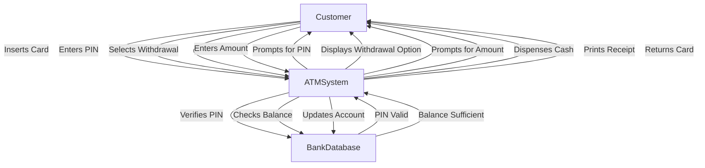

# Unit 5

### Q-5.1) State the difference between Procedural Design and Object-Oriented Design.

Here’s a comparison between **Procedural Design** and **Object-Oriented Design**:

| **Aspect**                       | **Procedural Design**                                               | **Object-Oriented Design**                                           |
|-----------------------------------|--------------------------------------------------------------------|---------------------------------------------------------------------|
| **Basic Concept**                 | Focuses on **procedures** (functions) to perform operations.       | Focuses on **objects** that represent entities with data and behavior. |
| **Approach**                      | Breaks the problem into smaller **functions**.                     | Breaks the problem into **objects** which contain both data and methods. |
| **Data and Functions**            | Keeps **data** and **functions** separate.                         | Combines **data** and related **functions** within objects.          |
| **State Management**              | Centralized state, shared among functions.                         | Decentralized state; each object manages its own state.              |
| **Modularity**                    | Based on **procedures** or functions.                              | Based on **objects** and **classes**.                                |
| **Data Encapsulation**            | Data is often **global** and exposed to the program.               | Data is **encapsulated** inside objects, promoting data security.    |
| **Reusability**                   | Limited reusability.                                               | High reusability through **inheritance** and **polymorphism**.       |
| **Interaction**                   | Functions interact by passing **data**.                            | Objects interact via **message passing** (method calls).             |
| **Focus**                         | Focuses on the **how** (steps) of problem-solving.                 | Focuses on the **what** (objects and interactions) of the problem.   |

---

### Summary:
- **Procedural Design** is function-based, where problems are solved by defining procedures or functions.
- **Object-Oriented Design** organizes the system into objects that encapsulate both data and behavior.

### Mnemonic to Remember:
- **POOD**: **P**rocedural focuses on **O**perations, **O**bject-oriented on **D**ata and behavior.

Let me know if you'd like more examples or further clarification!

---

### Q-5.2) Explain the design concepts Modularity and Functional Independence in detail.

#### 1. **Modularity**
**Modularity** is the design concept of breaking down a software system into **smaller, manageable components** or modules, each responsible for a specific part of the system's functionality.

##### Key Points:
- **Modular Design** allows a large system to be divided into smaller, self-contained units called **modules**.
- Each module performs a specific **function** or task and can be developed independently.
- This separation of concerns makes the system more **manageable**, **scalable**, and easier to **debug**.

##### Benefits of Modularity:
- **Simplified Complexity**: A complex system becomes easier to understand when broken into smaller modules.
- **Independent Development**: Modules can be developed, tested, and maintained independently.
- **Reusability**: Modules can be reused in different parts of the system or even in different projects.
- **Maintainability**: Fixing or updating a specific module is easier without affecting the entire system.
  
##### Example of Modularity:
Imagine a Library Management System. You can break it down into modules like:
- **Book Management** (manages book-related operations)
- **Member Management** (handles user registration and details)
- **Transaction Management** (manages borrowing/returning books)

These independent modules make the system easier to build and maintain.

---

#### 2. **Functional Independence**
**Functional Independence** is achieved when modules perform a single, well-defined function with **minimal interaction** with other modules. It is a key principle for maintaining the quality of modular design.

##### Key Points:
- A module should have **high cohesion** (each module does only one thing) and **low coupling** (minimal dependence on other modules).
- The goal is to **minimize interaction** between modules, allowing them to function independently without needing to rely on other parts of the system.
  
##### Characteristics of Functional Independence:
- **Cohesion**: This refers to how closely related the tasks performed by a single module are. A **highly cohesive** module performs one task very well.
- **Coupling**: This refers to how much a module depends on other modules. **Low coupling** means a module is less dependent on other modules, making it more independent.

##### Benefits of Functional Independence:
- **Increased Maintainability**: Easier to make changes to a specific module without impacting others.
- **Better Testing**: Independent modules can be tested separately.
- **Improved Flexibility**: Independent modules can be easily replaced or upgraded.
  
##### Example of Functional Independence:
In a **Banking System**, consider a **Transaction Processing** module that only handles deposit and withdrawal operations. It shouldn't directly depend on a **User Authentication** module. Instead, the system should manage these functions separately with minimal interaction.

---

### Summary:
- **Modularity** breaks down complex systems into manageable, independent units.
- **Functional Independence** ensures that each module is cohesive and has minimal interaction (low coupling) with other modules.

---

### Q-5.3) Define design process. Explain Design concept.

#### **Design Process**
The **Design Process** in software engineering is a structured method to transform the requirements gathered in the **requirement analysis** phase into a well-organized blueprint that will guide the coding and implementation phase. It is a systematic approach where a software system's architecture, components, interfaces, and data are defined.

##### Key Steps in the Design Process:
1. **Understand Requirements**: Ensure that the system requirements are clear and well-documented.
2. **Design Strategy**: Decide whether to follow a top-down or bottom-up design approach.
3. **Architectural Design**: Define the overall structure and architecture of the software.
4. **Detailed Design**: Break down the system into components, specifying detailed interactions.
5. **Design Validation**: Verify that the design meets all functional and non-functional requirements.

The design process aims to deliver a **blueprint** that developers can follow to build the system effectively.

---

#### **Design Concepts**
Design concepts are fundamental ideas that help guide software engineers in crafting effective and efficient designs. These concepts form the backbone of a robust design and help ensure that the system is maintainable, scalable, and high-performing.

##### **1. Abstraction**
Abstraction is the process of simplifying complex systems by focusing on the high-level overview and hiding unnecessary details.
- **Example**: In a banking system, an "account" can be treated as an abstract entity with basic operations like deposit and withdraw, without detailing the underlying implementation.

##### **2. Modularity**
As discussed earlier, modularity is the division of a software system into smaller, manageable components or modules. Each module handles a specific function of the system.
- **Example**: In an e-commerce application, separate modules can handle user management, product inventory, and payment processing.

##### **3. Encapsulation**
Encapsulation refers to bundling the data (variables) and the methods (functions) that manipulate the data into a single unit or object. It also restricts access to certain details of an object to protect data from unauthorized access.
- **Example**: A class in an object-oriented system encapsulates both attributes (data) and methods (functions) that operate on that data.

##### **4. Coupling and Cohesion**
- **Coupling**: Refers to the degree of dependency between modules. **Low coupling** is desirable as it implies that changes in one module will not heavily affect others.
- **Cohesion**: Refers to how closely related the responsibilities of a module are. **High cohesion** is preferred because it indicates that the module focuses on a single task.

##### **5. Hierarchy**
Hierarchy organizes components into levels, often depicted as a tree, where higher levels control the lower ones. This concept is used to define relationships between system components.
- **Example**: Class inheritance in object-oriented design represents hierarchy.

##### **6. Refinement**
Refinement is the process of elaborating the system at different levels of detail. The design starts with a general outline and becomes progressively more detailed.
- **Example**: Starting with an architectural design and refining it into more detailed component designs.

##### **7. Information Hiding**
Information hiding suggests that internal implementation details of modules should be hidden from other modules. Only necessary information (interfaces) should be exposed.
- **Example**: A database module hides how data is stored and only exposes operations like `insert`, `update`, and `delete`.

##### **8. Functional Independence**
As discussed in Q-5.2, functional independence ensures that modules are designed to function independently, promoting low coupling and high cohesion.

##### **9. Patterns**
Design patterns provide solutions to common design problems. They offer standardized ways to solve recurring problems in software design.
- **Example**: The Singleton pattern ensures a class has only one instance and provides a global point of access to it.

##### **10. Reusability**
A good design promotes the reuse of components across different parts of the system or even in different projects. This reduces redundancy and increases efficiency.
- **Example**: Using a generic **logging module** that can be reused in multiple applications to track errors.

---

### Summary:
- The **Design Process** transforms requirements into a structured blueprint, guiding the development phase.
- **Design Concepts** like abstraction, modularity, and encapsulation help create maintainable, scalable, and efficient software.

### Mnemonic to Remember:
- **A MECH-RIF**: **A**bstraction, **M**odularity, **E**ncapsulation, **C**ohesion, **H**ierarchy, **R**efinement, **I**nformation hiding, **F**unctional independence.

---

### Q-5.4) What is coupling? Explain the various types of coupling?

#### **Coupling**
**Coupling** refers to the degree of **interdependence** between software modules. It is a measure of how closely connected or dependent the modules are on each other. In software design, the goal is to achieve **low coupling**, which means the modules have minimal dependencies on one another. This helps in creating more **maintainable**, **scalable**, and **flexible** software systems.

**High coupling** means that modules are highly dependent on one another, which makes the system more difficult to maintain, test, and modify.

---

#### **Types of Coupling**
Coupling can be classified into different types based on the level of dependency between the modules:

| **Type of Coupling**        | **Description**                                                                                       | **Example**                                                                                               |
|-----------------------------|-------------------------------------------------------------------------------------------------------|-----------------------------------------------------------------------------------------------------------|
| **1. Content Coupling**      | One module directly modifies or relies on the internal workings (data or logic) of another module.     | Module A directly accesses the internal data or logic of Module B, bypassing its interface.                 |
| **2. Common Coupling**       | Multiple modules share the same global data, which introduces a shared dependency.                    | Modules A and B both access a global variable, leading to dependency on the shared data.                    |
| **3. External Coupling**     | Modules are dependent on external tools, libraries, or frameworks that they share.                    | Modules depend on the same external framework for their execution (e.g., database or network protocols).    |
| **4. Control Coupling**      | One module controls the behavior of another by passing control information (e.g., flags).             | Module A passes a control flag to Module B, which alters the way Module B behaves.                          |
| **5. Stamp/Data-structured Coupling** | Modules share a composite data structure but use only parts of it.                                 | Module A passes a complex data structure to Module B, but Module B only uses certain parts of the structure. |
| **6. Data Coupling**         | Modules share only necessary data. This is the most desirable form of coupling.                       | Module A passes only the necessary parameters (e.g., a string or integer) to Module B.                      |
| **7. Message Coupling**      | Modules communicate using message-passing mechanisms, ensuring the highest level of independence.     | Objects in an object-oriented system interact by sending messages to each other, preserving encapsulation.   |

---

### **Detailed Explanation of Coupling Types:**

#### 1. **Content Coupling** (Worst)
- **Definition**: One module modifies or depends on the internal workings of another (e.g., accessing private variables or functions).
- **Example**: Module A directly accesses internal variables of Module B and modifies them. This leads to tightly bound modules that are hard to maintain.

#### 2. **Common Coupling**
- **Definition**: Multiple modules have access to the same global data. This makes the modules interdependent, as changes in the global data affect all modules.
- **Example**: Modules A and B access and modify a shared global variable. A change in the global variable affects both modules, introducing complexity.

#### 3. **External Coupling** (Not in Darshan PPT)
- **Definition**: When modules depend on external systems, tools, or libraries that they both use. These external systems are shared dependencies.
- **Example**: Two modules rely on the same database connection or external service. If the external system changes, both modules are affected.

#### 4. **Control Coupling**
- **Definition**: One module controls the flow of another by passing information that determines its execution, often using flags or control parameters.
- **Example**: Module A passes a flag (like `true` or `false`) to Module B, determining which part of the code in Module B should be executed.

#### 5. **Stamp Coupling** (Data-structured Coupling)
- **Definition**: Modules share a composite data structure (like a record or object), but only parts of it are used. This introduces unnecessary dependency on the entire structure.
- **Example**: Module A passes a complex data structure to Module B, but Module B only uses a portion of it, making the relationship more complex than necessary.

#### 6. **Data Coupling** (Best)
- **Definition**: Modules communicate by passing only the necessary data or parameters. This is the **ideal** level of coupling because it minimizes dependencies.
- **Example**: Module A passes specific data, like an integer or string, to Module B, ensuring only the required information is exchanged.

#### 7. **Message Coupling** (Best in Object-Oriented Design)
- **Definition**: Modules communicate by sending messages, often in object-oriented designs where objects interact without sharing internal details. This ensures the highest independence.
- **Example**: Objects in an object-oriented system send messages to each other, asking for data or invoking behavior without exposing their internal workings.

---

### Summary:
- **Coupling** is a measure of how much one module depends on another.
- **High Coupling**: Modules are tightly bound; changes in one affect the other.
- **Low Coupling**: Modules are independent and communicate with minimal data exchange.

### Mnemonic to Remember:
- **CCC-DS-DM**: **C**ontent, **C**ommon, **C**ontrol, **D**ata-structured, **D**ata, **M**essage (from worst to best coupling types).

---

### Q-5.5) What is cohesion? Explain the various types of cohesion?

#### **Cohesion**
**Cohesion** refers to the degree to which the elements within a module belong together. It measures how closely related and focused the responsibilities of a single module are. High cohesion within a module is desirable as it indicates that the module has a single, well-defined purpose. This leads to better maintainability, reusability, and clarity in software design.

Cohesion can be viewed on a spectrum, ranging from **low cohesion**, where elements of the module are unrelated, to **high cohesion**, where elements work together towards a common goal.

---

#### **Types of Cohesion**
Cohesion can be classified into different types based on the degree of relatedness among the module's components:

| **Type of Cohesion**                  | **Description**                                                                                        | **Example**                                                                                             |
|---------------------------------------|--------------------------------------------------------------------------------------------------------|---------------------------------------------------------------------------------------------------------|
| **1. Coincidental Cohesion**         | The parts of a module are grouped arbitrarily; they have little or no relationship with each other.    | A utility module that contains a collection of unrelated functions like `printReport`, `calculateTax`.  |
| **2. Logical Cohesion**               | The module performs a set of related actions but with a broad interface; it is often implemented using control flags. | A module that processes various file types (text, images, etc.) but requires a parameter to specify the type. |
| **3. Temporal Cohesion**              | The elements are grouped together by when they are executed, meaning they occur at the same time.      | A module that initializes various components during system startup (e.g., loading configuration, initializing databases). |
| **4. Procedural Cohesion**            | The module contains elements that are grouped together because they always follow a specific sequence of execution. | A module that processes a transaction, where steps like checking balance, deducting amount, and updating records are executed sequentially. |
| **5. Communicational Cohesion**       | The components of the module operate on the same data or contribute to the same output.                | A module that reads a file and processes its data to generate a report, where all functions work on the same data set. |
| **6. Sequential Cohesion**            | The output of one part of the module serves as the input for another part, establishing a sequence.     | A module that reads data from a database, processes it, and then formats it for display; the output of one function feeds into the next. |
| **7. Functional Cohesion**            | All parts of the module contribute to a single, well-defined task; this is the highest level of cohesion. | A module that only performs user authentication by validating credentials and managing sessions. |

---

### **Detailed Explanation of Cohesion Types:**

#### 1. **Coincidental Cohesion** (Worst)
- **Definition**: Elements are grouped arbitrarily, and there is no meaningful relationship among them.
- **Example**: A utility module that includes functions for logging, printing, and calculating areas.

#### 2. **Logical Cohesion**
- **Definition**: Elements are related logically, but the relationships are weak and implemented with control flags.
- **Example**: A module that handles multiple types of user input (e.g., keyboard, mouse, touchscreen) but requires a flag to specify the input type.

#### 3. **Temporal Cohesion**
- **Definition**: Elements are grouped by their timing of execution. They are executed together at a particular time or event.
- **Example**: A module that initializes all components of an application during startup.

#### 4. **Procedural Cohesion**
- **Definition**: Elements are related because they are part of a specific sequence of actions or operations.
- **Example**: A module that manages a series of steps to process an order: verify payment, pack items, and ship the order.

#### 5. **Communicational Cohesion**
- **Definition**: Elements work on the same data or contribute to the same output.
- **Example**: A module that reads and processes a customer's order from a file, where all functions manipulate the same order data.

#### 6. **Sequential Cohesion**
- **Definition**: The output from one part of the module is the input for another, creating a clear sequence of operations.
- **Example**: A module that processes a list of transactions where one function generates a report from the transaction data produced by another.

#### 7. **Functional Cohesion** (Best)
- **Definition**: All parts of the module contribute to a single well-defined task. This is the highest level of cohesion and is desirable.
- **Example**: A module dedicated solely to user authentication, performing tasks like checking passwords and managing sessions.

---

### Summary:
- **High Cohesion**: Indicates a module with a clear purpose, leading to better maintainability.
- **Low Cohesion**: Results in unrelated elements within a module, making maintenance challenging.

### Mnemonic to Remember:
- **C-LT-PC-C-S-F**: **C**oincidental, **L**ogical, **T**emporal, **P**rocedural, **C**ommunicational, **S**equential, **F**unctional (from worst to best cohesion types).

---

# Unit 6

### Q-6.1) Distinguish between Verification & Validation

**Answer**:  
Verification and validation are two crucial activities in the software development lifecycle aimed at ensuring that the software system meets its requirements and is free of defects. Here's a detailed comparison:

| **Aspect**             | **Verification**                                     | **Validation**                                       |
|------------------------|-----------------------------------------------------|-----------------------------------------------------|
| **Definition**          | Process of evaluating software at each development phase to ensure it meets the specified requirements. | Process of evaluating software at the end of the development process to ensure it meets the user's needs. |
| **Objective**           | Are we building the product right?                  | Are we building the right product?                  |
| **Focus**               | Ensures the product is developed correctly according to requirements and design specifications. | Ensures the product fulfills its intended purpose and meets user requirements. |
| **Type of Activity**    | Static testing (without executing the code)         | Dynamic testing (executing the code)                |
| **Performed By**        | QA Team                                             | Testing Team & End Users                            |
| **Techniques Used**     | Reviews, walkthroughs, inspections                  | Testing (Black-box, white-box, etc.)                |
| **Timing**              | Done throughout the development process             | Done after the software development is complete     |
| **Cost of Errors**      | Lower cost to fix errors found during verification  | Higher cost to fix errors found during validation   |
| **Example**             | Ensuring the design document conforms to requirements before coding starts. | Ensuring the final product operates correctly in the user's environment. |

### Summary:
- **Verification** ensures the product is built **according to specifications**.
- **Validation** ensures the product **meets the user’s needs**.
  
### Mnemonic to Remember:
- **V**erification = **V**ersus Specifications.
- **V**alidation = **V**ersus User Needs.

---

### Q-6.2) Discuss the differences between Black Box and White Box Testing

**Answer**:  
Black box and white box testing are two different approaches to testing software, each focusing on different aspects of the system

| **Aspect**             | **Black Box Testing**                             | **White Box Testing**                              |
|------------------------|--------------------------------------------------|--------------------------------------------------|
| **Definition**          | Testing the software functionality without knowing the internal code structure. | Testing the software with knowledge of the internal code structure and logic. |
| **Focus**               | Focuses on the **external behavior** of the system (what the software does). | Focuses on the **internal workings** of the system (how the software does it). |
| **Knowledge Required**  | The tester does not need to know the programming languages, algorithms, or internal structure. | The tester needs detailed knowledge of the code, programming languages, and logic. |
| **Techniques Used**     | - Equivalence Partitioning<br>- Boundary Value Analysis<br>- Decision Table Testing<br>- State Transition Testing | - Statement Coverage<br>- Branch Coverage<br>- Path Coverage<br>- Condition Coverage |
| **Test Design**         | Based on **requirements** and **functional specifications**. | Based on **code structure** and **logic flow**. |
| **Performed By**        | Generally performed by **testers** or QA teams. | Typically performed by **developers** or testers with programming knowledge. |
| **Type of Testing**     | **Functional testing**: Focuses on what the software should do. | **Structural testing**: Focuses on how the software operates internally. |
| **Coverage**            | Covers a **limited number of test cases** based on inputs and outputs. | Covers **all possible paths** in the code, ensuring every statement and branch is tested. |
| **Tools Used**          | - Selenium<br>- QTP<br>- LoadRunner | - JUnit<br>- NUnit<br>- CUnit |
| **Example**             | Testing if a login feature correctly allows access with valid credentials and denies access with invalid credentials. | Testing the logic inside the login function, including how passwords are encrypted and compared with stored values. |

### Summary:
- **Black Box Testing** tests the **functionality** without looking at the internal code.
- **White Box Testing** tests the **internal structure** and logic of the code.
  
### Mnemonic to Remember:
- **Black Box** = **B**ehavior-based.
- **White Box** = **W**orking of code.

---

### Q-6.3) What do you mean by System Testing? Explain in detail.

**Answer**:  
**System testing** is a type of testing where the entire software system is tested as a whole to verify that it meets its specified requirements. It is performed after integration testing and before acceptance testing in the software development lifecycle.

System testing checks both the functional and non-functional aspects of the system to ensure that the software behaves as expected in various conditions.

### Key Aspects of System Testing:

1. **Scope**:  
   System testing focuses on verifying that the entire integrated software system functions correctly in an environment similar to the production environment.

2. **Goal**:  
   The main goal is to validate the end-to-end functionality of the system and check whether the system meets the business requirements, both functional and non-functional (like performance, security, and usability).

### Types of System Testing:

System testing includes several types of tests to cover different areas:

| **Type**                  | **Description**                                                                                  |
|---------------------------|--------------------------------------------------------------------------------------------------|
| **Functional Testing**     | Verifies that the system performs the specified functions according to requirements.             |
| **Performance Testing**    | Tests the system's performance under load, stress, and different conditions (e.g., speed, stability). |
| **Stress Testing**         | Tests how the system behaves under extreme workloads or stress to ensure it doesn't crash.       |
| **Security Testing**       | Ensures that the system is protected from unauthorized access and vulnerabilities.               |
| **Recovery Testing**       | Verifies how well the system can recover from crashes or failures, such as data loss or downtime.|
| **Usability Testing**      | Checks if the system is user-friendly and provides a good user experience (UI/UX).              |
| **Compatibility Testing**  | Ensures that the system works as expected across different devices, platforms, and environments. |
| **Regression Testing**     | Ensures that new changes do not introduce errors in previously working functionality.            |

### Example of System Testing:
Let's say you're developing an e-commerce platform. During system testing, you would:
- Test if users can browse products, add items to the cart, and complete the checkout process.
- Simulate thousands of users browsing the site to check for performance bottlenecks.
- Test if unauthorized users can access restricted areas like the admin panel.
- Verify that the system recovers properly after a simulated server crash.

### When is System Testing Performed?
- **After Integration Testing**: All modules are integrated and unit tests are complete.
- **Before Acceptance Testing**: The system is ready for validation by end users or clients.

### Tools for System Testing:
Some common tools for system testing include:
- **Selenium** for functional testing of web applications.
- **JMeter** for performance and load testing.
- **Burp Suite** for security testing.

### Summary:
- **System testing** ensures that the complete software system meets the business and technical requirements.
- It covers functional and non-functional aspects, making sure the system works as expected in a real-world environment.
  
### Mnemonic to Remember:
- **System Testing** = **S**ystem's **T**otal behavior and functionality check.

---

### Q-6.4) What is BVA? Explain merits and demerits of BVA.

**Answer**:  
**BVA (Boundary Value Analysis)** is a black-box testing technique used to test the boundary conditions of input data. The idea behind BVA is that errors tend to occur at the boundaries of input ranges, making it important to test these edge cases. Instead of testing just typical values, BVA focuses on **values at the boundaries** (e.g., minimum, maximum, just below minimum, just above maximum).

### Key Concepts of Boundary Value Analysis (BVA):

- **Boundary values** are the **extreme ends** of input domains, where bugs are most likely to appear.
- BVA involves testing at:
  - The **minimum** value.
  - The **maximum** value.
  - **Just below the minimum** value.
  - **Just above the maximum** value.
  
For example, if an input range is between 1 and 100:
- Boundary values to test would be 0, 1, 100, and 101.

### Example:
For a form that accepts age as an input field with a range of 18 to 60, you would test the following values:
- **Lower boundary**: 17, 18, 19
- **Upper boundary**: 59, 60, 61

### Merits of BVA:

| **Merits**                                    | **Explanation**                                                                 |
|-----------------------------------------------|---------------------------------------------------------------------------------|
| **Covers critical test cases**                | Focuses on the most error-prone areas, i.e., boundary values, where bugs are likely to occur. |
| **Efficient testing**                         | Helps in reducing the number of test cases while still maintaining good coverage. |
| **Detects edge cases**                        | Ensures that the system behaves correctly at boundary values where errors tend to occur. |
| **Applicable to many domains**                | Can be applied to various types of systems (e.g., numeric ranges, strings, date ranges). |
| **Simple and effective**                      | Easy to apply and understand, especially for systems with clearly defined input ranges. |

### Demerits of BVA:

| **Demerits**                                  | **Explanation**                                                                 |
|-----------------------------------------------|---------------------------------------------------------------------------------|
| **Limited coverage**                          | BVA only focuses on boundary values and may miss defects in **non-boundary** areas. |
| **Not suitable for complex inputs**           | For complex input fields like multi-dimensional inputs, BVA might not be sufficient to catch all errors. |
| **Doesn’t address interaction between variables** | BVA does not account for situations where multiple inputs interact, potentially causing issues. |
| **Risk of ignoring non-boundary conditions**   | Testing may focus too heavily on boundary cases, neglecting valid middle values. |

### Summary:
- **Boundary Value Analysis (BVA)** tests input at the boundaries of the input domain.
- It is an effective and widely-used black-box testing technique that helps identify errors where they are most likely to occur: at the **boundary values**.
  
### Mnemonic to Remember:
- **BVA** = **B**order **V**alue **A**ssessment.

---

### Q-6.5) What is Black Box Testing? What are the different Black Box Testing Techniques?

**Answer**:  
**Black Box Testing** is a software testing technique in which the tester does not need to know the internal structure or code of the application. The focus is solely on testing the functionality of the software by providing inputs and verifying the outputs against the expected results. Black box testing is concerned with **what** the system does, not **how** it does it.

### Key Concepts of Black Box Testing:
- **Tester’s knowledge**: The tester does not need access to the source code.
- **Focus**: Ensures the system behaves according to specifications by testing inputs, outputs, and user interactions.
- **Objective**: To check the system’s behavior, functionality, usability, and compliance with requirements.

### Different Black Box Testing Techniques:

1. **Equivalence Partitioning**:
   - **Description**: Divides the input data into **equivalent classes** where the system is expected to behave similarly. Test cases are created for each class.
   - **Example**: For an age input field accepting values between 18 and 60, you would create test cases for valid inputs (18-60) and invalid ones (below 18, above 60).

2. **Boundary Value Analysis (BVA)**:
   - **Description**: Focuses on testing the **boundary values** of input domains. Since errors often occur at boundaries, BVA ensures that these edge cases are covered.
   - **Example**: For an input range of 1 to 100, test cases would include 0, 1, 99, and 100.

3. **Decision Table Testing**:
   - **Description**: Creates a **decision table** based on the different combinations of inputs and corresponding system behavior (outputs). This technique is useful for testing systems with multiple conditions.
   - **Example**: In an online banking system, decision table testing can cover different combinations of user actions like login, transfer funds, and logout.

4. **State Transition Testing**:
   - **Description**: Tests the behavior of the system as it transitions between **states** based on input or events. Each transition is tested to ensure the system reacts appropriately.
   - **Example**: Testing a login system that locks a user out after 3 failed login attempts. Each state (login success, login fail, locked out) would be tested.

5. **Cause-Effect Graphing**:
   - **Description**: A graphical representation that links **causes (inputs)** to their **effects (outputs)**, helping to derive test cases that focus on combinations of input conditions.
   - **Example**: In a traffic light system, causes could be time of day, traffic sensor inputs, etc., and the effects could be green, yellow, or red lights.

6. **Error Guessing**:
   - **Description**: Based on the tester's experience, specific areas of the system where errors are **likely to occur** are targeted for testing.
   - **Example**: In an e-commerce platform, testers might specifically test the checkout process for potential issues like payment failures or invalid coupon codes.

### Summary:
- **Black Box Testing** focuses on verifying the system's functionality without knowing the internal code. 
- It ensures the system meets the user requirements by testing inputs and outputs.
- Several techniques, such as **Equivalence Partitioning**, **BVA**, **Decision Table**, and **State Transition Testing**, help design effective test cases.

### Conclusion:
Black box testing is crucial for validating software from a user perspective. It helps ensure that the software functions correctly under various input conditions without needing to understand the code itself.

### Key Points:
- **Black Box Testing** tests **functionality** based on specifications, not internal code.
- Various techniques help in creating test cases for different input conditions and system states.

### Mnemonic to Remember:
- **Black Box** = **B**ehavior-based **T**esting without knowing the **B**ack-end code.

---

### Q-6.6) Using your own words, describe the difference between verification and validation. Do both make use of test-case design methods and testing strategies?

**Answer**:  
**Verification** and **Validation** are both critical processes in software engineering that aim to ensure the quality of the software, but they focus on different aspects of the system.

- **Verification** is the process of checking whether the software is being built **correctly** according to the specifications and design. It ensures that the product adheres to the specified requirements during various phases of development. It answers the question, "**Are we building the product right?**"
  
  **Example**: During the verification process, developers ensure that the code aligns with the design documents and requirements, such as checking if a function correctly implements a specific algorithm.

- **Validation**, on the other hand, is the process of checking whether the **final product** meets the **user's needs** and requirements. It ensures that the product fulfills its intended purpose after the development is complete. It answers the question, "**Are we building the right product?**"
  
  **Example**: Validation involves testing the software in real-world scenarios to make sure it works as intended for the user, such as testing if the user can successfully complete tasks like logging in or making a purchase.

### Key Differences:

| **Aspect**        | **Verification**                                 | **Validation**                                   |
|-------------------|--------------------------------------------------|-------------------------------------------------|
| **Focus**         | Checks if the product is built according to the design and requirements. | Checks if the final product meets user needs.   |
| **Process Type**  | Static (without running the code)                | Dynamic (involves running the code)             |
| **Question**      | "Are we building the product right?"             | "Are we building the right product?"            |
| **Techniques**    | Reviews, inspections, walkthroughs              | Testing (functional, usability, acceptance)     |
| **Performed By**  | QA team, developers                              | Testing team, end users                        |

### Do Both Use Test-Case Design Methods and Testing Strategies?

- **Verification** typically does not involve test-case design methods in the traditional sense since it focuses on **reviews** and **inspections** of the design and code, without executing it. It’s more about ensuring that the development process follows the specified requirements and standards.

- **Validation**, however, heavily relies on **test-case design methods** and various **testing strategies**. This is because validation involves **running the software** to ensure that it functions correctly from the user's perspective. Techniques like **black-box testing**, **system testing**, and **user acceptance testing** are used to validate the final product.

### Summary:
- **Verification** ensures that the software is being built according to requirements, focusing on **correct implementation** without executing code.
- **Validation** ensures that the software **works for the user**, focusing on **correct functionality** by running the code.
- **Verification** = Process correctness.
- **Validation** = Product correctness.

  
### Mnemonic to Remember:
- **Verification** = **V**ersus requirements.
- **Validation** = **V**ersus real-world use.

---

### Q-6.7) What is White Box Testing? What are the Different Coverage-Based Testing Strategies?

#### Answer:

#### White Box Testing:
White Box Testing, also known as **Clear Box**, **Glass Box**, or **Open Box** testing, is a software testing technique where the internal workings of the application are tested. The tester has knowledge of the internal logic, code structure, and implementation details of the software. This type of testing is performed to ensure the code works as expected, covering aspects like code flow, logic, loops, and conditions.

#### Key Points:
- **Tester Knowledge**: The tester knows the internal structure of the code.
- **Goal**: The goal is to improve the code quality, find hidden bugs, and optimize the code's performance.
- **Scope**: It involves testing loops, statements, branches, and data flow.

#### Example of White Box Testing:
Imagine a login system where you test whether the username and password validation functions work correctly by looking at the logic inside these functions, not just by testing them from the outside like a user.

#### Different Coverage-Based Testing Strategies:
White Box Testing can be broken down into various coverage-based testing strategies, each focusing on covering different parts of the code.

| **Coverage Strategy**         | **Description**                                                                                         | **Focus**                                      |
|-------------------------------|---------------------------------------------------------------------------------------------------------|------------------------------------------------|
| **Statement Coverage**         | Ensures every statement in the code has been executed at least once.                                     | All executable statements                      |
| **Branch Coverage**            | Ensures that every possible branch from each decision point is executed (e.g., both true and false paths).| Decision points (like if-else)                 |
| **Condition Coverage**         | Tests the individual boolean expressions in decision points. Ensures each condition is tested separately.| Boolean conditions in decision statements      |
| **Path Coverage**              | Ensures that every possible path through a program is tested.                                             | All possible paths through the code            |
| **Function Coverage**          | Ensures that all functions or methods in the code are executed.                                           | Function or method calls                       |
| **Loop Coverage**              | Ensures that all loops (like `for`, `while`) are tested, including boundary conditions (e.g., zero iterations). | Loops with different iteration conditions     |

#### Summary of Coverage Strategies:
1. **Statement Coverage** ensures every line of code is executed.
2. **Branch Coverage** checks all the possible paths in decision-making.
3. **Condition Coverage** validates all individual conditions.
4. **Path Coverage** focuses on covering all unique execution paths.
5. **Function Coverage** checks that every function has been invoked at least once.
6. **Loop Coverage** ensures that loops are tested with various iteration counts.

#### Mnemonic to Remember Coverage Strategies:
- **S**tudents **B**ring **C**olorful **P**ens **F**or **L**ectures
  - **S**tatement Coverage
  - **B**ranch Coverage
  - **C**ondition Coverage
  - **P**ath Coverage
  - **F**unction Coverage
  - **L**oop Coverage

#### Conclusion:
White Box Testing focuses on the internal structure of the software, ensuring that all logical paths and internal code flows are correct. The various coverage-based strategies ensure that the testing is comprehensive, with each one addressing a specific aspect of the code.

---

### Q-6.8) What Do You Mean by Integration Testing? Explain Their Outcomes.

#### Answer:

#### Integration Testing:
Integration testing is a level of software testing where individual software modules are combined and tested as a group. The primary purpose of this testing phase is to identify and fix issues that arise when different components or systems interact with each other. Integration testing focuses on verifying that the interfaces between different modules or services are functioning correctly.

#### Key Points:
- **Objective**: Ensure that combined modules work together as expected.
- **Focus**: Testing the interaction between integrated units or modules.
- **Performed by**: Both developers and testers.
  
#### Types of Integration Testing:
1. **Big Bang Approach**:
   - All modules are integrated at once and tested together.
   - **Advantage**: Straightforward, requires fewer steps.
   - **Disadvantage**: Difficult to pinpoint the cause of failures when issues occur.

2. **Top-Down Approach**:
   - Higher-level modules are tested first, and lower-level modules are tested step-by-step.
   - **Stub**: A dummy module used in place of lower modules during testing.
   - **Advantage**: Early testing of higher-level logic.
   - **Disadvantage**: Stubs need to be created, which may add overhead.

3. **Bottom-Up Approach**:
   - Lower-level modules are tested first, and higher-level modules are tested progressively.
   - **Driver**: A dummy module used in place of higher modules during testing.
   - **Advantage**: Core functionality is tested early.
   - **Disadvantage**: Drivers are required, and higher-level logic is tested later.

4. **Sandwich (Hybrid) Approach**:
   - A combination of the Top-Down and Bottom-Up approaches.
   - **Advantage**: Balances early testing of both high-level and low-level modules.
   - **Disadvantage**: Can be complex to implement.

#### Example of Integration Testing:
Suppose you're developing an online shopping website where one module handles the user login, and another module manages the shopping cart. Integration testing would check whether, after logging in, the user can access their cart and whether these modules communicate correctly.

#### Outcomes of Integration Testing:
1. **Interface Issues Detected**:
   - **Outcome**: Errors are found in how different modules communicate or share data. For example, mismatched data types or incorrect API calls.

2. **Data Flow Issues Identified**:
   - **Outcome**: Issues in the flow of data between modules are discovered. For instance, data sent from one module might be missing or misformatted when received by another.

3. **Module Dependency Errors**:
   - **Outcome**: Unresolved dependencies or incorrect interaction between modules are identified. This ensures that all required modules are present and functioning together.

4. **Unexpected Behavior**:
   - **Outcome**: Modules might behave correctly in isolation, but combined, they could produce unexpected results. Integration testing catches these issues.

5. **Performance Bottlenecks**:
   - **Outcome**: The system might slow down when multiple modules are integrated, revealing performance issues like slow database queries or poor API response times.

6. **Successful Integration**:
   - **Outcome**: When no issues are found, the modules work correctly together, and the integrated system is ready for further testing (such as system testing or acceptance testing).

#### Summary of Outcomes:
- **Interface issues**: Detected when modules fail to communicate.
- **Data flow problems**: Identified when data doesn't pass between modules as expected.
- **Dependency issues**: Arise due to unresolved or missing dependencies.
- **Unexpected behavior**: Occurs due to incorrect interaction between modules.
- **Performance issues**: Surface when integration leads to slow or inefficient operations.
- **Successful integration**: Ensures that modules interact as designed.

#### Mnemonic to Remember Integration Testing Outcomes:
- **I**nterface
- **D**ata Flow
- **D**ependencies
- **U**nexpected Behavior
- **P**erformance Bottlenecks
- **S**uccessful Integration

**Mnemonic**: **"I** **D**iscover **D**isruptions **U**nder **P**ressure, **S**olve Quickly!"

#### Conclusion:
Integration testing is essential for ensuring that individual modules work well when combined. It helps detect interface, data flow, and dependency issues early in the development cycle, preventing costly errors down the line. By addressing integration problems, the system becomes more robust and reliable for end users.

---

### Q-6.9) Define Basic Path Testing
**(Avoid Reading this question from here)**
#### Answer:

#### Basic Path Testing:
**Basic Path Testing** is a type of **White Box Testing** technique used to ensure that every possible path of execution in a program is covered at least once. The main goal of this testing method is to derive a set of test cases that will execute every statement, decision, and condition in the code at least once. It is based on the control flow of the program and focuses on testing the logical complexity of the program to identify potential errors in the flow.

#### Key Concepts:
- **Control Flow Graph (CFG)**: 
  - A graphical representation of all paths that might be traversed through a program during its execution. Nodes represent processing statements, and edges represent the control flow between them.
  
- **Cyclomatic Complexity**: 
  - A quantitative measure of the logical complexity of a program. It is calculated to determine the minimum number of test cases required to ensure that all independent paths in a program are tested.
  - **Formula**: 
    \[
    \text{Cyclomatic Complexity (V(G))} = E - N + 2
    \]
    Where:
    - **E** = Number of edges in the control flow graph.
    - **N** = Number of nodes in the control flow graph.

#### Steps in Basic Path Testing:
1. **Draw the Control Flow Graph (CFG)**:
   - Represent all the nodes (statements) and edges (control flows) of the program.
   
2. **Calculate the Cyclomatic Complexity (V(G))**:
   - Use the formula to determine how many independent paths exist in the program.

3. **Identify Independent Paths**:
   - An independent path is a path that introduces at least one new edge or node not covered in any previously identified paths.

4. **Design Test Cases**:
   - Create test cases that cover all independent paths derived from the control flow graph.

#### Example:
Consider the following pseudo-code:
```text
1. Start
2. Read X
3. If X > 10 then
4.   Print "X is large"
5. Else
6.   Print "X is small"
7. End
```

- **Control Flow Graph (CFG)**:
   - Nodes: Start, Read X, If X > 10, Print "X is large", Print "X is small", End
   - Edges: Between these nodes, showing the decision-making flow.

- **Cyclomatic Complexity**:
   - The graph has 6 edges (E = 6) and 5 nodes (N = 5). 
   - Using the formula: \( V(G) = E - N + 2 = 6 - 5 + 2 = 3 \)
   - Hence, the cyclomatic complexity is 3, indicating three independent paths.

- **Test Cases**:
   - Path 1: Take the path where \( X > 10 \) (covering the decision that prints "X is large").
   - Path 2: Take the path where \( X \leq 10 \) (covering the decision that prints "X is small").
   - Path 3: Ensure that the decision logic in the "if" statement is executed.

#### Mnemonic to Remember Basic Path Testing:
- **C**ontrol **F**low **G**raph
- **C**yclomatic **C**omplexity
- **I**ndependent **P**aths
- **T**est **C**ases

**Mnemonic**: "**C**ool **F**riends **G**ather, **C**onsider **C**ritical **I**ssues, **P**lay **T**ests **C**arefully."

#### Conclusion:
Basic Path Testing is an effective technique to ensure that all logical paths within a program are exercised at least once, minimizing potential errors in the program's control flow. By focusing on the independent paths, this technique helps in achieving good test coverage and improving code quality.

---

### Q-6.10) What is White Box Testing? Why is it Required? Discuss Different Techniques of it?

#### Answer:

#### What is White Box Testing?

**White Box Testing**, also known as **Glass Box Testing**, **Clear Box Testing**, or **Open Box Testing**, is a method of software testing that examines the internal structure, design, and coding of the software. In this approach, the tester has knowledge of the internal workings of the system and tests the functionality by looking inside the code.

#### Key Points:
- **Internal Testing**: The focus is on internal logic, statements, branches, loops, and data flow.
- **Transparency**: The tester has full access to the source code and uses this knowledge to design test cases.
  
#### Why is White Box Testing Required?

White Box Testing is required for several reasons:
1. **Improving Code Quality**: It helps in identifying hidden errors like security loopholes, broken paths, and unused variables.
2. **Optimization**: Helps in improving performance by identifying bottlenecks or redundant code.
3. **Testing Security**: Ensures that security vulnerabilities (e.g., buffer overflows, incorrect access control) are identified and corrected early.
4. **Ensuring Code Coverage**: Helps achieve high code coverage by ensuring that all paths in the code are executed.

#### Different Techniques of White Box Testing:

White Box Testing involves several techniques aimed at covering all possible paths, conditions, and statements. Here are the major techniques used in White Box Testing:

| **Technique**          | **Description**                                                                                                                                                     | **Focus Area**                                                                                                   |
|------------------------|---------------------------------------------------------------------------------------------------------------------------------------------------------------------|------------------------------------------------------------------------------------------------------------------|
| **Statement Coverage**  | Ensures that every statement in the code is executed at least once.                                                                                                  | Tests all statements (lines of code) to ensure none are left unexecuted.                                         |
| **Branch Coverage**     | Ensures that every branch in the decision-making statements (like `if`, `else`, `switch`) is executed at least once.                                                 | Tests all decision branches. For example, both the "true" and "false" branches in an `if-else` statement.        |
| **Condition Coverage**  | Ensures that each individual condition in decision-making structures evaluates to both true and false at least once.                                                  | Tests each condition within a decision statement (e.g., testing both true and false outcomes for each condition). |
| **Path Coverage**       | Ensures that every possible path in the control flow of the program is tested.                                                                                       | Tests all independent execution paths to ensure all parts of the program are covered.                            |
| **Loop Testing**        | Focuses on testing loops (e.g., `for`, `while`, `do-while`) by checking boundary conditions (e.g., zero iterations, one iteration, and multiple iterations).         | Tests loop constructs to ensure they work correctly with various iteration counts.                               |
| **Data Flow Testing**   | Focuses on the lifecycle of variables, ensuring that they are properly defined, used, and killed (released) within the program.                                       | Tests how variables are initialized, used, and terminated in the code.                                           |
| **Control Flow Testing**| Maps out the flow of control in the program using a control flow graph to identify any gaps or redundant operations in the control flow.                              | Tests the sequence in which statements are executed to ensure proper flow.                                       |

#### 1. **Statement Coverage**:
- **Goal**: Ensure that every line of code is executed at least once.
- **Why it's important**: Ensures no part of the code is skipped during execution.
- **Example**: For a function that adds two numbers, statement coverage would ensure that both the addition and return statement are executed.

#### 2. **Branch Coverage**:
- **Goal**: Ensure that every possible branch of decision points (`if-else`, `switch`) is executed.
- **Why it's important**: Ensures all decision-making paths in the code are tested.
- **Example**: If there's an `if-else` statement, both the "true" and "false" outcomes should be tested.

#### 3. **Condition Coverage**:
- **Goal**: Ensure all individual conditions in decision statements evaluate to both true and false.
- **Why it's important**: Ensures that every condition has been thoroughly tested.
- **Example**: If a decision statement has multiple conditions (e.g., `if (A && B)`), condition coverage will test for both A and B being true and false.

#### 4. **Path Coverage**:
- **Goal**: Ensure that every independent path through the code is executed.
- **Why it's important**: Guarantees that all potential routes through the program are tested.
- **Example**: If a program can follow different paths depending on user input, path coverage ensures all paths are taken.

#### 5. **Loop Testing**:
- **Goal**: Test loops with various iteration counts, including zero iterations.
- **Why it's important**: Ensures loops work correctly under different conditions.
- **Example**: Testing a `for` loop by running it zero times, one time, and multiple times to check behavior.

#### 6. **Data Flow Testing**:
- **Goal**: Track the flow of data through the program to ensure variables are used correctly.
- **Why it's important**: Detects issues like uninitialized variables, incorrect usage, or unused variables.
- **Example**: Ensures that a variable is initialized before it is used and that it is released when no longer needed.

#### 7. **Control Flow Testing**:
- **Goal**: Examine the order in which instructions are executed and ensure the control flows properly from one part to another.
- **Why it's important**: Prevents issues such as dead code or unnecessary loops.
- **Example**: Mapping out all possible sequences of execution to verify correct flow and avoid inefficiencies.

#### Mnemonic to Remember White Box Techniques:
- **S**mart **B**ugs **C**an **P**lan **L**ogic **D**efects **C**leverly
  - **S**tatement Coverage
  - **B**ranch Coverage
  - **C**ondition Coverage
  - **P**ath Coverage
  - **L**oop Testing
  - **D**ata Flow Testing
  - **C**ontrol Flow Testing

#### Conclusion:
White Box Testing is essential for ensuring internal code quality and reducing errors by focusing on the internal workings of the system. By using different techniques such as statement, branch, condition, path, loop, and data flow testing, testers can comprehensively test the code and achieve high levels of code coverage.

---

# Unit-7

## Q-7.1) List and Explain SQA Tasks

#### Answer:
Software Quality Assurance (SQA) is a set of activities designed to ensure that the software development process and the software product conform to defined standards and procedures. Here is a list of key **SQA Tasks** along with brief explanations:

| **SQA Task**                               | **Explanation**                                                                                                                                                                                                                                                                                                                                 |
|--------------------------------------------|-----------------------------------------------------------------------------------------------------------------------------------------------------------------------------------------------------------------------------------------------------------------------------------------------------------------------------------------------------|
| **Prepare an SQA Plan for a Project**      | An SQA plan is created to define the scope, activities, and responsibilities of quality assurance in a software project. It identifies the standards, tools, and techniques to be used.                                                                                                                                                               |
| **Participate in Software Process Description** | SQA teams take part in defining and documenting the software development process to ensure compliance with industry standards and project-specific quality goals.                                                                                                                                                                                     |
| **Review Software Engineering Activities** | Regular reviews are conducted to verify that software engineering activities follow the defined processes and standards. These reviews help identify and correct any deviations early in the development cycle.                                                                                                                                         |
| **Audit Software Work Products**           | This involves conducting audits on software documents (such as design documents, code, and test plans) to ensure that they comply with predefined standards. The audit verifies that the software work products align with the planned development processes.                                                                                         |
| **Ensure Deviations are Handled**          | When deviations from standards or procedures are identified, they are documented and corrective actions are applied. Proper documentation ensures traceability and allows for improvements in future projects.                                                                                                                                         |
| **Record Non-Compliance and Report**       | Any non-compliance issues are recorded, and reports are generated for senior management. This ensures accountability and helps in making management decisions for process improvement and rectification.                                                                                                                                               |

#### Key Points:
- **SQA tasks** involve planning, reviewing, auditing, and handling deviations to ensure product quality.
- The **SQA plan** is a roadmap that includes standards, activities, and tools for quality assurance.
- **Audits and reviews** play a crucial role in verifying compliance with the software process.
- **Non-compliance** is documented and reported for corrective measures.

---

## Q-7.2) Write short note on Software CMM levels

#### Answer:
The **Capability Maturity Model (CMM)** is a framework that assesses the maturity of an organization’s software development processes. It defines **five levels of process maturity**, where each level represents a degree of process standardization and improvement.

Here is a brief overview of the **Software CMM levels**:

| **CMM Level**         | **Description**                                                                                                                                                           |
|-----------------------|---------------------------------------------------------------------------------------------------------------------------------------------------------------------------|
| **Level 1: Initial**   | At this level, the software process is **ad hoc** and chaotic. Few processes are defined, and success depends on individual effort. Projects often exceed budgets and timelines. |
| **Level 2: Repeatable**| Basic **project management processes** are established to track cost, schedule, and functionality. Projects are planned and managed based on previous experiences.              |
| **Level 3: Defined**   | The software process is **well-defined, standardized, and documented** across the organization. It includes both engineering and management activities.                       |
| **Level 4: Managed**   | At this level, the organization **uses metrics** to control processes and products. Detailed measures of the software process and product quality are collected and analyzed.    |
| **Level 5: Optimizing**| The organization focuses on **continuous process improvement**. Quantitative feedback from processes and innovative technologies are used to enhance both product and process.  |

#### Key Points:
- **CMM Level 1** lacks formal processes and relies on individuals.
- **CMM Level 2** introduces basic management practices.
- **CMM Level 3** ensures processes are standardized and consistent.
- **CMM Level 4** emphasizes metrics and control.
- **CMM Level 5** focuses on continuous improvement.

---

## Q-7.3) Write short note on SIX SIGMA

#### Answer:
**Six Sigma** is a data-driven methodology aimed at improving the quality of processes by minimizing defects and reducing variability. It is widely used in industries, including **software engineering**, to achieve operational excellence and enhance product quality. Six Sigma focuses on **measuring and improving process performance** with the ultimate goal of achieving **no more than 3.4 defects per million opportunities**.

Six Sigma follows two main methodologies:
1. **DMAIC**: Used for improving existing processes.
   - **Define**: Define the problem and goals related to customer requirements.
   - **Measure**: Measure the current process performance.
   - **Analyze**: Analyze data to find the root causes of defects.
   - **Improve**: Implement solutions to improve the process.
   - **Control**: Monitor the improved process to sustain the gains.

2. **DMADV**: Used for developing new processes or products.
   - **Define**: Define design goals consistent with customer demands.
   - **Measure**: Measure and identify CTQs (Critical to Quality characteristics).
   - **Analyze**: Analyze to develop design alternatives.
   - **Design**: Design the process or product.
   - **Verify**: Verify the design performance and capability.

#### Key Points:
- Six Sigma targets **process improvement** by reducing defects.
- It has **two methodologies**: DMAIC (for existing processes) and DMADV (for new processes).
- Aims for a high-quality level with **no more than 3.4 defects per million opportunities**.
- Widely applied to **software engineering** to improve quality and efficiency.

---

## Q-7.4) Explain Formal Technical Review

#### Answer:
A **Formal Technical Review (FTR)** is a structured and systematic process used in **software quality control**. It involves reviewing the software product (such as code, design, or documentation) to identify defects and ensure it meets the defined requirements and standards. FTR is conducted by a team of peers, usually software engineers, and helps in detecting issues early in the development process, which leads to reduced costs and higher product quality.

#### Objectives of FTR:
- To **uncover errors** in logic, functionality, and implementation.
- To verify that the software **meets its requirements**.
- To ensure the software is developed according to **predefined standards**.
- To ensure that projects are **more manageable** by detecting errors early.
  
#### Key Roles in an FTR:
- **Moderator**: Leads the review process, ensuring it follows the agenda.
- **Author**: The person responsible for the software product under review.
- **Reviewers**: Typically peers or experts who evaluate the product.
- **Recorder**: Takes notes during the review, records defects, and compiles the formal review report.

#### Steps in FTR:
1. **Preparation**: The product to be reviewed is distributed to the review team in advance, and members prepare for the meeting by examining the material.
2. **Meeting**: The review meeting is conducted following a strict agenda, with the focus on detecting errors rather than solving them.
3. **Issue Logging**: During the meeting, a **recorder** documents any issues or defects raised by the reviewers.
4. **Follow-up**: The identified defects are corrected, and follow-up meetings may be scheduled to verify the corrections.

#### Key Points:
- FTR focuses on **identifying defects early**, reducing the overall cost of fixing issues.
- It requires **formal preparation** and adherence to an agenda.
- The outcome is a formal **report** documenting the errors and corrective actions.
- FTR improves both **product quality** and the **development process** by enforcing standards and early error detection.

---

# Unit 4
## Q-S1) Explain Composition and Aggregation with an Example in a Class Diagram?

### Answer:

### **Composition:**
**Composition** is a form of association that represents a strong "whole-part" relationship between objects. In composition, the lifetime of the part (child) depends on the whole (parent). If the parent object is destroyed, the child objects are also destroyed automatically. This relationship is denoted by a **filled diamond** on the parent side.

### Example of Composition:
Consider a **House** and **Rooms**. A **House** is composed of multiple **Rooms**. If the **House** is destroyed, the **Rooms** are also destroyed.

```plaintext
House
+ address: String
+ addRoom(): void

Room
+ roomNumber: int
+ getRoomNumber(): int
```

### UML Representation of Composition:
```plaintext
[House] ◼───[Room]
```

- **House** has a strong composition relationship with **Room**.
example of ppt


---

### **Aggregation:**
**Aggregation** is a weaker form of association that represents a "whole-part" relationship where the part can exist independently of the whole. The lifetime of the part does **not** depend on the whole. This relationship is denoted by an **empty diamond** on the parent side.

### Example of Aggregation:
Consider a **Library** and **Books**. A **Library** has a collection of **Books**, but the **Books** can exist independently of the **Library**.

```plaintext
Library
+ libraryName: String
+ addBook(): void

Book
+ title: String
+ getTitle(): String
```

### UML Representation of Aggregation:
```plaintext
[Library] ◇───[Book]
```

- **Library** has a weak aggregation relationship with **Book**.


---


### **Comparison Table** of Composition vs. Aggregation:

| **Aspect**               | **Composition**                         | **Aggregation**                          |
|--------------------------|-----------------------------------------|------------------------------------------|
| **Type of Relationship**  | Strong "whole-part"                     | Weak "whole-part"                        |
| **Dependency**            | Child objects depend on parent          | Child objects can exist independently    |
| **Notation**              | Filled diamond (◼)                     | Empty diamond (◇)                        |
| **Example**               | House and Rooms                        | Library and Books                        |

### **Key Points:**
- **Composition:** Strong relationship; child cannot exist without parent.
- **Aggregation:** Weak relationship; child can exist independently of the parent.

**Mnemonics to Remember:**
- **C**omposition = **C**omplete dependency (parent and child die together).
- **A**ggregation = **A**ssociative (parent and child live separately).

---

## Q-S2) Explain Generalization and Specialization in Class Diagram with Example

### Answer:

### **Generalization:**
**Generalization** is a relationship between a more **general** class (parent) and a more **specific** class (child). It represents an **"is-a"** relationship where the child class inherits properties and behavior (attributes and methods) from the parent class. The parent class contains the common features, while the child class adds or overrides specific features.

- **Key Concept:** A subclass (child) is a specialized version of the superclass (parent).

### Example of Generalization:
Consider a class **Vehicle** as the general class, and **Car** and **Bike** as the specialized subclasses.

```plaintext
Vehicle
+ brand: String
+ speed: int
+ accelerate(): void

Car
+ numOfDoors: int
+ openTrunk(): void

Bike
+ hasCarrier: bool
+ ringBell(): void
```

In this case:
- **Car** is a **Vehicle**.
- **Bike** is a **Vehicle**.

### UML Representation of Generalization:
```plaintext
            [Vehicle]
             /   \
      [Car]      [Bike]
```

- Both **Car** and **Bike** inherit common attributes like **brand** and **speed** from **Vehicle**.

---

### **Specialization:**
**Specialization** is the process of creating new subclasses from a general class to define specific attributes and behaviors. The subclass specializes the general class by adding new features or behaviors.

- **Key Concept:** The process of creating more specific subclasses from a general superclass.

### Example of Specialization:
In the same example of **Vehicle**, **Car** and **Bike** specialize the general class by adding their own specific attributes and methods:
- **Car** adds the attribute **numOfDoors** and method **openTrunk()**.
- **Bike** adds the attribute **hasCarrier** and method **ringBell()**.

### UML Representation of Specialization:
```plaintext
            [Vehicle]
             /   \
      [Car]      [Bike]
```

- **Car** specializes **Vehicle** by adding car-specific features.
- **Bike** specializes **Vehicle** by adding bike-specific features.

---

### **Comparison Table** of Generalization vs. Specialization:

| **Aspect**               | **Generalization**                       | **Specialization**                      |
|--------------------------|------------------------------------------|-----------------------------------------|
| **Direction**             | From specific (subclass) to general      | From general (superclass) to specific   |
| **Purpose**               | To represent common features             | To create specific versions of a class  |
| **Example**               | Vehicle is a generalization of Car and Bike | Car and Bike are specializations of Vehicle |

### **Key Points:**
- **Generalization**: Parent to child inheritance of common features (is-a relationship).
- **Specialization**: Creating subclasses with added specific features from a general parent class.

**Mnemonics to Remember:**
- **G**eneralization = "**G**rouping common" features.
- **S**pecialization = "**S**pecific details" in child classes.


---

## Q-S3) Explain Multiplicity and Cardinality with an Example in Class Diagram

### Answer:

### **Multiplicity**:
**Multiplicity** refers to the number of instances of one class that can be associated with an instance of another class in a class diagram. It defines how many objects of a class are involved in the relationship between two classes.

### **Notation for Multiplicity**:
- `1`: Exactly one instance.
- `0..1`: Zero or one instance (optional relationship).
- `*`: Zero or more instances (many).
- `n`: Exactly `n` instances.
- `n..m`: From `n` to `m` instances.

### **Example of Multiplicity**:
In a relationship between **Library** and **Books**:
- A **Library** can have multiple **Books** (denoted by `*`).
- A **Book** belongs to exactly one **Library** (denoted by `1`).

```plaintext
[Library] 1 ─── * [Book]
```

### Explanation:
- **Library** can have many books.
- Each **Book** belongs to exactly one **Library**.


---

### **Cardinality**:
**Cardinality** defines the range or exact number of instances in a relationship. It is closely related to multiplicity but usually describes the **minimum** and **maximum** number of instances allowed in a relationship.

### **Notation for Cardinality**:
- The notation for cardinality is typically the same as multiplicity, with lower and upper bounds such as `0..1`, `1`, `0..*`, etc.
- It emphasizes the count or range of instances involved.

### **Example of Cardinality**:
In a relationship between **Teacher** and **Student**:
- A **Teacher** can teach multiple **Students** (denoted by `0..*`).
- Each **Student** can have multiple **Teachers** (denoted by `1..*`).

```plaintext
[Teacher] 0..* ─── 1..* [Student]
```

### Explanation:
- **Teacher** can teach zero or more students.
- **Student** can be taught by one or more teachers.

---

### **Comparison Table** of Multiplicity vs. Cardinality:

| **Aspect**               | **Multiplicity**                         | **Cardinality**                         |
|--------------------------|------------------------------------------|-----------------------------------------|
| **Definition**            | Number of instances related between classes | Range of instances involved in a relationship |
| **Usage**                 | Defines "how many" objects are involved  | Defines the **exact** or **range** of instances |
| **Example Notation**      | `1`, `0..*`, `*`                        | `0..1`, `1..*`, `n..m`                  |

### **Key Points**:
- **Multiplicity** refers to "how many" instances can participate in a relationship.
- **Cardinality** defines the **range** or **specific number** of instances in a relationship.
  
**Mnemonics to Remember**:
- **M**ultiplicity = **M**any instances possible (focus on "how many").
- **C**ardinality = **C**ount (focus on the exact or range of instances).

---

## Q-S4) Draw and Explain the Bank Management System Class Diagram

### Answer:

### **Class Diagram for Bank Management System**:

A **Bank Management System** involves multiple entities like **Bank**, **Account**, **Customer**, and **Transaction**. Below is a class diagram representing these relationships.

### UML Representation:
```plaintext
[Bank] ◼───1..* [Account]
+ name: String
+ location: String
+ openAccount(): void
+ closeAccount(): void

[Account] ◇───1 [Customer]
+ accountNumber: int
+ balance: double
+ deposit(amount: double): void
+ withdraw(amount: double): void

[Customer]
+ name: String
+ customerID: int
+ address: String
+ createAccount(): void

[Transaction]
+ transactionID: int
+ transactionType: String
+ amount: double
+ date: Date
+ executeTransaction(): void
```

### **Explanation of the Classes**:

1. **Bank**:
   - **Attributes**:
     - `name`: The name of the bank.
     - `location`: The location of the bank.
   - **Methods**:
     - `openAccount()`: Opens a new account.
     - `closeAccount()`: Closes an existing account.
   - **Association**: The **Bank** class has a **composition** relationship with **Account**, meaning that if the bank is closed, all its accounts are destroyed as well.

2. **Account**:
   - **Attributes**:
     - `accountNumber`: A unique identifier for the account.
     - `balance`: The balance of the account.
   - **Methods**:
     - `deposit(amount)`: Deposits a specified amount into the account.
     - `withdraw(amount)`: Withdraws a specified amount from the account.
   - **Association**: The **Account** class has an **aggregation** relationship with **Customer**, meaning an account is related to a customer, but a customer can exist without an account.

3. **Customer**:
   - **Attributes**:
     - `name`: Name of the customer.
     - `customerID`: Unique identifier for the customer.
     - `address`: Address of the customer.
   - **Methods**:
     - `createAccount()`: Method for creating a new account.
   - **Association**: A customer is associated with one or more accounts. A customer can have multiple accounts, but each account belongs to one customer.

4. **Transaction**:
   - **Attributes**:
     - `transactionID`: Unique identifier for the transaction.
     - `transactionType`: Type of the transaction (e.g., deposit, withdrawal).
     - `amount`: The amount involved in the transaction.
     - `date`: The date of the transaction.
   - **Methods**:
     - `executeTransaction()`: Method to execute the transaction.
   - **Association**: Each transaction is linked to an account and a customer but is modeled separately for clarity.

### **Key Points**:
- **Bank** contains multiple **Accounts**.
- Each **Account** is owned by one **Customer**.
- **Transactions** are linked to accounts and involve deposits or withdrawals.

### **Class Relationships**:
- **Composition** between **Bank** and **Account**: If the bank is destroyed, so are the accounts.
- **Aggregation** between **Account** and **Customer**: A customer can exist without an account, but accounts belong to customers.

---

IN DARSHAN PPT


The bank management system class diagram illustrates the structure and relationships between different classes in a banking software system. It provides a visual representation of the system's object-oriented design.


### Class Breakdown:

1. **Bank**:
   - Attributes: name, code
   - Method: manageBranch()
   - Relationships: Has multiple ATMs and Branches

2. **ATM**:
   - Attributes: location, manageBy
   - Method: transaction()
   - Managed by a Branch

3. **Branch**:
   - Attributes: branchName, branchCode
   - Methods: manageAccount(), transaction()
   - Manages ATMs, Accounts, and Customers

4. **Account**:
   - Attributes: accountNumber, balance
   - Methods: debitAmount(), creditAmount(), getBalance()
   - Belongs to a Branch and owned by a Customer

5. **Customer**:
   - Attributes: name, address, dob, panNumber
   - Methods: manageAccount(), transaction()
   - Managed by a Branch, can have multiple Accounts

6. **CurrentAccount** and **SavingAccount**:
   - Subclasses of Account
   - SavingAccount has additional interestRate attribute and isTransactionLimitOut() method

### Mnemonic to Remember Class Relationships:

"**BABAC**" - Bank manages Branch, Branch manages ATM, Branch has Accounts, Accounts belong to Customers

This mnemonic helps recall the main relationships between classes in the bank management system.

---

## Q-S5) Explain Use Case Diagram with Notation Symbols and Example

### Answer:

### **Use Case Diagram:**
A **Use Case Diagram** illustrates the system's functionalities and the interactions between **actors** (users or external systems) and **use cases** (functionalities of the system). It helps visualize how the system behaves from the user's perspective.

---

### **Notation Symbols in Use Case Diagram:**


---

### **Example of Use Case Diagram: Bank ATM System**

Here’s a simple **Use Case Diagram** for an **ATM system**, showing how users interact with the system to perform basic banking tasks.

### Use Case Diagram:
```plaintext
+--------------------------------------+
|         ATM System                   |
| +----------------------------+      |
| |     Withdraw Cash           |      |
| +----------------------------+      |
| +----------------------------+      |        +------------+
| |      Deposit Cash           |      |<------>|  Customer  |
| +----------------------------+      |        +------------+
| +----------------------------+      |
| |     Check Balance           |      |
| +----------------------------+      |
+--------------------------------------+
```

### **Explanation**:
1. **Actors**:
   - **Customer**: A user who interacts with the ATM system to perform operations like withdrawing or depositing cash.
   
2. **Use Cases**:
   - **Withdraw Cash**: The customer can withdraw money from their account.
   - **Deposit Cash**: The customer can deposit money into their account.
   - **Check Balance**: The customer can check their account balance.

3. **System Boundary**: The **ATM System** is encapsulated within a **system boundary** box that defines the system's scope. All use cases fall within this boundary, representing the functionalities provided by the ATM system.

### **Include and Extend Relationships**:
- **Include**: If a use case like **Authenticate User** is necessary before accessing any functionality, it would be **included** in all other use cases.
- **Extend**: An optional functionality like **Print Receipt** could be represented as an **extend** relation with the **Withdraw Cash** use case, since it’s not always necessary.

---

### **Key Points**:
- **Actor**: Represents external users or systems interacting with the system.
- **Use Case**: Describes specific functionalities provided by the system.
- **System Boundary**: Defines the scope of the system.
- **Include**: Indicates mandatory behavior that a use case must perform.
- **Extend**: Represents optional or conditional behavior.

**Mnemonics to Remember**:
- **A**ctor: **A** person/system interacting with the system.
- **U**se Case: **U**sers' specific actions.

---

## Q-S6) Draw and explain Use case diagram of library management system.

#### **Use Case Diagram Explanation**

A **use case diagram** in a library management system depicts how various users (actors) interact with the system to achieve different goals or tasks. The key actors in the system might include **Librarian**, **Student**, **Staff**, and **Administrator**, while the main functions would include managing books, issuing and returning books, and managing members.

I will now describe a **use case diagram** for a **Library Management System**, based on typical system interactions:

---

### **Use Case Diagram for Library Management System**

```plaintext
                   +--------------------------------+
                   |      Library Management System |
                   +--------------------------------+
                               ^
                               |
     +--------------------------------------------+
     |                                            |
 +---+---+                                  +-----+------+
 |Student|                                  |  Librarian |
 +-------+                                  +------------+
      |                                          |
      |                                          |
  +------------+                        +----------------+
  | Borrow Book|                        | Issue Book     |
  +------------+                        +----------------+
      |                                          |
  +------------+                        +----------------+
  | Return Book|                        | Manage Books   |
  +------------+                        +----------------+
      |                                          |
  +------------+                        +----------------+
  | Pay Fine   |                        | Manage Members |
  +------------+                        +----------------+
                                              
```

---

#### **Actors in the Use Case Diagram**:
- **Student**: 
  - **Borrow Book**: Students can borrow books from the library.
  - **Return Book**: Students return the borrowed books to the library.
  - **Pay Fine**: If a student has a fine for late returns, they can pay it.

- **Librarian**:
  - **Issue Book**: The librarian manages the issuing of books to students.
  - **Manage Books**: The librarian is responsible for adding, removing, and updating the books in the library.
  - **Manage Members**: The librarian manages user data, including registration and removal of students and other members.

---

### **Use Cases Explained**:

1. **Borrow Book**:
   - **Actors involved**: Student, Librarian.
   - **Description**: A student requests a book, and the librarian checks its availability. If available, the librarian issues the book to the student, recording the transaction.

2. **Return Book**:
   - **Actors involved**: Student, Librarian.
   - **Description**: A student returns a borrowed book. The librarian accepts the book and updates the system to reflect the return.

3. **Pay Fine**:
   - **Actors involved**: Student.
   - **Description**: If a book is returned late, the student is required to pay a fine before borrowing new books.

4. **Issue Book**:
   - **Actors involved**: Librarian, Student.
   - **Description**: The librarian issues books to students, maintaining a record of all issued and returned books.

5. **Manage Books**:
   - **Actors involved**: Librarian.
   - **Description**: The librarian handles adding new books, removing outdated books, and updating the book database.

6. **Manage Members**:
   - **Actors involved**: Librarian, Administrator.
   - **Description**: The librarian or administrator manages the student and staff records, adding new users or removing old ones.

---

### Summary:
The **use case diagram** visually depicts how different users (actors) like **Students** and **Librarians** interact with a library management system. It provides a high-level overview of the system's core functionalities, including borrowing books, managing books, and paying fines.

### Conclusion:
The use case diagram clarifies how different actors interact with the system, helping in understanding system functionality and user requirements.

### Key Points:
- **Actors**: Student, Librarian, Administrator.
- **Use Cases**: Borrow Book, Return Book, Pay Fine, Issue Book, Manage Books, Manage Members.

IN DARSAHN PPT


---

## Q-S7) What are the elements of a behavioral model? Prepare use case diagram and sequence diagrams for ATM system of a bank.

#### **Elements of a Behavioral Model**

A **behavioral model** in software engineering captures the dynamic aspects of a system, focusing on how the system behaves in different scenarios. The core elements of a behavioral model are:

1. **Use Cases**: These define the functional requirements by describing how users (actors) interact with the system to achieve specific goals.
2. **Sequence Diagrams**: These illustrate how objects in a system interact with each other over time by showing the sequence of messages exchanged between them.
3. **State Diagrams**: These represent the states an object can be in and how it transitions from one state to another in response to events.
4. **Activity Diagrams**: These show the flow of activities or processes in the system, capturing the workflow among various components.

---

### **Use Case Diagram for ATM System**

The **ATM system** of a bank provides functionalities like cash withdrawal, balance inquiry, depositing cash, and changing the PIN. Here's a use case diagram that depicts the interactions of the users (customers) with the ATM system:

```plaintext
+--------------------------------------------+
|                ATM System                  |
+--------------------------------------------+
                ^         ^         ^
                |         |         |
       +--------+     +---+---+    +------+
       | Cash   |     |Balance |    | PIN  |
       |Withdrawal|   | Inquiry|    |Change|
       +--------+     +-------+    +------+
           ^              ^            ^
           |              |            |
        +------+      +--------+   +---------+
        |Customer|    |Customer|   |Customer |
        +------+      +--------+   +---------+
```

#### **Actors**:
- **Customer**: The user of the ATM system who can perform tasks such as withdrawing cash, checking account balance, and changing the PIN.

#### **Use Cases**:
- **Cash Withdrawal**: The customer inserts their ATM card, enters the PIN, and selects the cash withdrawal option to withdraw money from their account.
- **Balance Inquiry**: The customer checks their current account balance using this option.
- **PIN Change**: The customer can change their ATM PIN using this functionality.

---

### **Sequence Diagram for ATM Cash Withdrawal**

In a **sequence diagram**, we show how objects (actors) interact with each other over time to complete a task. Below is the sequence diagram for the **cash withdrawal** process from an ATM system:

```plaintext
Customer       ATM Machine         Bank Server
   |                |                   |
   |  Insert Card   |                   |
   |--------------->|                   |
   |                |                   |
   |  Enter PIN     |                   |
   |--------------->|                   |
   |                |    Validate PIN   |
   |                |------------------>|
   |                |                   |
   |                |  PIN Valid/Invalid|
   |                |<------------------|
   |                |                   |
   |  Select Amount |                   |
   |--------------->|                   |
   |                | Request Withdrawal|
   |                |------------------>|
   |                |   Confirm Balance |
   |                |<------------------|
   |                |                   |
   |    Dispense Cash                    |
   |<---------------|                   |
   |                |                   |
```

---

### Explanation of Sequence Diagram:

1. **Insert Card**: The customer inserts their ATM card into the ATM machine.
2. **Enter PIN**: The customer enters their PIN, and the ATM machine sends this information to the bank server for validation.
3. **Validate PIN**: The bank server verifies if the PIN is correct and sends a validation response back to the ATM machine.
4. **Select Amount**: The customer selects the amount of cash they wish to withdraw.
5. **Request Withdrawal**: The ATM sends a withdrawal request to the bank server.
6. **Confirm Balance**: The bank server checks the account balance and approves or declines the transaction.
7. **Dispense Cash**: The ATM dispenses the cash to the customer if the transaction is approved.

---

### Summary:

- **Behavioral models** represent the dynamic behavior of systems through interactions between users and system components.
- For an **ATM system**, key interactions include cash withdrawal, balance inquiry, and PIN change.
- The **use case diagram** shows the main functionalities of the system, and the **sequence diagram** represents the flow of events during cash withdrawal.

### Conclusion:
Behavioral models like **use case** and **sequence diagrams** provide valuable insights into the flow of interactions in a system. They help developers understand the roles of different components and ensure smooth user experience.

### Key Points:
- Elements of a behavioral model include **use cases**, **sequence diagrams**, **state diagrams**, and **activity diagrams**.
- **ATM system** key interactions: Cash withdrawal, balance inquiry, PIN change.
- Sequence diagrams represent the **step-by-step** flow of messages between actors and system objects.

Let me know if you need further explanation or details!

## Q-S8) Explain Components of Sequence Diagram with Example

#### **Introduction to Sequence Diagrams**
A **sequence diagram** is a type of **interaction diagram** in UML (Unified Modeling Language) that shows how objects interact with each other in a particular sequence of events. It emphasizes the **order** of message exchanges between objects (or actors) over time to achieve a specific outcome.

---

### **Components of a Sequence Diagram**

A sequence diagram consists of several key components:

| **Component**       | **Description**                                                                 |
|---------------------|---------------------------------------------------------------------------------|
| **Actor**           | A user or external system that interacts with the system. Represented by a stick figure. |
| **Object**          | A class or entity in the system that performs actions or receives actions. Represented by rectangles with underlined names. |
| **Lifeline**        | A dashed vertical line that shows the object's existence over time.              |
| **Activation Bar**  | A narrow rectangle on a lifeline showing that an object is active or executing a task at that point in time. |
| **Messages**        | Horizontal arrows between objects indicating communication or method calls.      |
| **Return Message**  | A dashed arrow showing a return from a message or method call.                   |
| **Self-Message**    | An arrow that loops back to the same object, representing recursive methods or internal processing. |
| **Guard Condition** | A condition that must be true for a message to be sent.                          |
| **Destruction**     | Represents the termination of an object. It’s shown as an ‘X’ at the end of a lifeline. |

---

### **Detailed Components**:

1. **Actor**:
   - Represents a person, external system, or entity interacting with the system.
   - Example: In an ATM system, the **Customer** is an actor.

2. **Objects**:
   - Objects represent instances of classes that interact in the system. They are denoted by a rectangle with the object name underlined.
   - Example: In the ATM system, objects like **ATM Machine**, **Bank Server** are involved.

3. **Lifeline**:
   - The vertical dashed line drawn from an object or actor represents its lifespan during the interaction.
   - Example: The **Customer's lifeline** begins when the customer interacts with the ATM system.

4. **Activation Bar**:
   - Indicates the period during which an object is active (performing tasks). It appears as a narrow rectangle on the object's lifeline.
   - Example: When the ATM is processing a transaction, its activation bar will be visible.

5. **Messages**:
   - Messages indicate interactions between objects. A solid arrow shows the call, while a dashed arrow indicates the return.
   - Example: The **Customer** sends a **withdrawal request** to the **ATM Machine**.

6. **Return Message**:
   - This is a dashed arrow that indicates the return of control from a message or method call.
   - Example: After a withdrawal request, the **ATM Machine** sends a **confirmation message** back to the **Customer**.

7. **Self-Message**:
   - A message that an object sends to itself. It’s represented by an arrow that loops back to the same object.
   - Example: The **ATM Machine** may internally check balance before processing the transaction.

8. **Guard Condition**:
   - A Boolean expression that must be true for a message to be sent. It is written in square brackets.
   - Example: The **withdrawal transaction** will only be processed if `[balance >= withdrawal amount]`.

9. **Destruction**:
   - The termination of an object during the interaction. It’s represented by an ‘X’ at the end of the lifeline.
   - Example: After the transaction is completed, the **ATM Machine** may terminate the session.

---

### **Example Sequence Diagram: ATM Withdrawal**

Here's an example sequence diagram for the **ATM cash withdrawal** process:

```plaintext
Customer      ATM Machine      Bank Server
   |               |                |
   | Insert Card   |                |
   |-------------> |                |
   |               | Validate Card  |
   |               |--------------> |
   |               | Card Valid     |
   |               | <--------------|
   | Enter PIN     |                |
   |-------------> |                |
   |               | Validate PIN   |
   |               |--------------> |
   |               | PIN Valid      |
   |               | <--------------|
   | Select Amount |                |
   |-------------> |                |
   |               | Request Amount |
   |               |--------------> |
   |               | Confirm Balance|
   |               | <--------------|
   | Dispense Cash |                |
   |<------------- |                |
```

---

### **Explanation of the Sequence Diagram Example:**

1. **Customer** inserts the ATM card into the **ATM Machine**.
2. **ATM Machine** sends a message to the **Bank Server** to validate the card.
3. **Bank Server** sends a confirmation message indicating the card is valid.
4. **Customer** enters the PIN, and **ATM Machine** forwards it to the **Bank Server** for validation.
5. Upon validation of the PIN, the **Customer** selects the withdrawal amount.
6. **ATM Machine** sends a withdrawal request to the **Bank Server**.
7. The **Bank Server** confirms the account balance and approves the withdrawal.
8. **ATM Machine** dispenses the cash to the **Customer**.

---


### Key Points:
- **Actor**: Represents a user or external entity interacting with the system.
- **Object**: Represents system components interacting in the sequence.
- **Lifeline**: Shows the existence of objects over time.
- **Messages**: Depict the communication between objects.

---

## Q-S9) Explain Components of State Diagram with Example

#### **Introduction to State Diagrams**
A **state diagram** (or **state machine diagram**) in UML is used to represent the dynamic behavior of a system. It depicts the various **states** an object or system can be in and how it transitions from one state to another in response to **events**.

---

### **Components of a State Diagram**

A state diagram consists of several key components:

| **Component**          | **Description**                                                                 |
|------------------------|---------------------------------------------------------------------------------|
| **State**              | Represents a specific condition or situation of an object during its lifetime.   |
| **Initial State**      | The state in which an object starts its lifecycle. Represented by a solid black circle. |
| **Final State**        | The state that indicates the end of the object's lifecycle. Represented by a black circle surrounded by a border. |
| **Transition**         | The movement from one state to another in response to an event.                  |
| **Event**              | An action or occurrence that triggers a transition.                              |
| **Action**             | A task or activity performed during a transition or within a state.              |
| **Guard Condition**    | A Boolean expression that must be true for a transition to occur.                |
| **Composite State**    | A state that contains nested states, indicating complex behavior.                |

---

### **Detailed Components:**

1. **State**:
   - Represents the **status** or **condition** of an object at a specific moment.
   - It is depicted as a **rounded rectangle** with the state's name written inside.
   - Example: In an **ATM system**, states could include **Idle**, **Card Inserted**, **Processing Transaction**, etc.

2. **Initial State**:
   - The starting point of the state diagram.
   - Represented by a **solid black circle**.
   - Example: The ATM begins in the **Idle** state when there is no activity.

3. **Final State**:
   - Represents the termination of the process or lifecycle of an object.
   - Depicted as a **black circle with a surrounding border**.
   - Example: In the ATM system, after a transaction is completed, the ATM reaches a **Session End** state.

4. **Transition**:
   - Shows how an object **moves** from one state to another in response to an **event**.
   - Depicted by a **solid arrow** between two states.
   - Example: When a customer **inserts a card**, the ATM moves from **Idle** to **Card Inserted** state.

5. **Event**:
   - An **action** or **input** that triggers a transition between states.
   - Example: Events in the ATM system could include **Card Inserted**, **PIN Entered**, **Withdraw Requested**, etc.

6. **Action**:
   - A task performed during a state transition or while the object is in a specific state.
   - Example: When in the **Card Inserted** state, the ATM might perform an action like **Validate Card**.

7. **Guard Condition**:
   - A **Boolean expression** that must evaluate to `true` for the transition to happen.
   - Example: The ATM system will only proceed to the **Processing Transaction** state if the condition **PIN is valid** is true.

8. **Composite State**:
   - A state that contains other **nested states** inside it.
   - Represents complex behavior where the system can enter a sub-state while in a broader state.
   - Example: In the **Processing Transaction** state, there could be **Validating PIN** and **Validating Balance** sub-states.

---

### **Example State Diagram: ATM System**

Here's an example of a state diagram for an **ATM system**:

```plaintext
+-----------------------+
|                       |
|       Idle            | <-------- Initial State
|                       |
+-----------------------+
          |
          V
+-----------------------+
|                       |
|   Card Inserted       | -------------> [Invalid Card] -> Final State
|                       |
+-----------------------+
          |
          V
+-----------------------+
|                       |
|    PIN Entered        | -------------> [Invalid PIN] -> Final State
|                       |
+-----------------------+
          |
          V
+-----------------------+
|                       |
| Processing Transaction|  --> [Low Balance] --> Final State
|                       |
+-----------------------+
          |
          V
+-----------------------+
|                       |
|   Transaction Done    |
|                       |  --> Final State
+-----------------------+
```

---

### **Explanation of the Example:**

1. **Idle**: The ATM begins in the **Idle** state, waiting for user input.
2. **Card Inserted**: Once a card is inserted, the ATM moves to the **Card Inserted** state.
3. **PIN Entered**: After the card is inserted, the user enters their PIN, and the ATM moves to the **PIN Entered** state.
4. **Processing Transaction**: If the PIN is valid, the ATM moves to the **Processing Transaction** state, where it checks the account balance and processes the request.
5. **Transaction Done**: If the transaction is successful, the system moves to the **Transaction Done** state.
6. **Final State**: The process ends, and the ATM returns to the **Final State** after the transaction.

---


### **Key Points**:
- **State**: Represents the current condition of an object.
- **Transition**: Represents the movement from one state to another.
- **Event**: An occurrence that triggers a transition.
- **Guard Condition**: A condition that must be satisfied for the transition.
- **Initial/Final State**: Represent the beginning and end of the process.

---

## Q-S10) What are Non-Functional Requirements?

### **Definition:**
**Non-functional requirements (NFRs)** refer to the criteria that specify the operation of a system rather than its specific behaviors or functionalities. They describe how a system performs certain actions and define its **quality attributes** like performance, usability, reliability, and security.

---

### **Key Characteristics of Non-Functional Requirements**:
1. **Quality Attributes**: Focus on how well the system performs rather than what the system does.
2. **Global Constraints**: Often affect the entire system rather than specific components or functionalities.
3. **Measurable**: They should be quantifiable so they can be tested or validated.
4. **User Experience**: NFRs often deal with aspects like user experience, operational limits, and security protocols.

---

### **Examples of Non-Functional Requirements**:

| **NFR Category**      | **Example**                                                                 |
|-----------------------|------------------------------------------------------------------------------|
| **Performance**        | The system should respond to user queries within 2 seconds.                  |
| **Usability**          | The user interface should be easy to navigate for both novice and expert users. |
| **Reliability**        | The system should have 99.9% uptime availability throughout the year.         |
| **Scalability**        | The system should support up to 10,000 concurrent users without performance degradation. |
| **Security**           | All transactions must be encrypted using SSL.                                |
| **Maintainability**    | The system should allow easy addition of new features with minimal impact on existing code. |
| **Portability**        | The software should run on both Windows and Linux environments.               |

---

### **Key Points to Remember**:
- Non-functional requirements define the **quality attributes** of a system.
- They can include aspects such as **performance**, **security**, **usability**, and **reliability**.
- Unlike functional requirements, NFRs focus on **how well** the system performs rather than **what it does**.

### **Mnemonic to Remember**: 
**FURPS** – a common acronym used to remember key categories of NFRs:
- **F**: Functionality (usability, security)
- **U**: Usability (user-friendliness)
- **R**: Reliability (uptime, error tolerance)
- **P**: Performance (speed, scalability)
- **S**: Supportability (maintainability, portability)

---

## Q-S11) What are Functional Requirements?

### **Definition:**
**Functional requirements** describe the specific behaviors, tasks, or functionalities that a system must perform. These requirements define **what the system is supposed to do** by detailing the inputs, behavior, and outputs of the system. They capture the essential functionality that satisfies the user's needs or business goals.

---

### **Key Characteristics of Functional Requirements**:
1. **Behavioral Focus**: Describes what actions or tasks the system should perform.
2. **User-Centric**: Often derived from user stories, scenarios, or business goals.
3. **Specific**: Clearly defined actions or processes, often broken down into smaller units like use cases.
4. **Testable**: Functional requirements should be verifiable and measurable through testing.

---

### **Examples of Functional Requirements**:

| **Functional Area** | **Example** |
|---------------------|-------------|
| **Login System**    | The system should allow users to log in using a valid username and password. |
| **Search Feature**  | The system should provide a search feature that allows users to find books by title, author, or ISBN. |
| **Transaction**     | The system should allow users to transfer money between accounts. |
| **Reporting**       | The system should generate a monthly report of sales for the admin. |
| **Notifications**   | The system should send email notifications when a user’s subscription is about to expire. |

---

### **Functional Requirements in Software Development**

1. **Use Case Specification**: The functional requirements describe individual use cases and define how the system interacts with users or other systems.
2. **User Interface Requirements**: Functional requirements often specify how users should interact with the system, like button clicks or form submissions.
3. **Business Rules**: Specific business rules or calculations that need to be implemented fall under functional requirements (e.g., "If the user is a premium member, apply a 10% discount").

---

### **Key Points to Remember**:
- Functional requirements define **what the system does**.
- They describe specific **tasks, operations, or interactions** that the system must support.
- Functional requirements are typically derived from **user needs** or **business processes**.

---

### **Mnemonic to Remember**:
**BRIFT** – to help remember key categories of functional requirements:
- **B**: Business Logic (how business rules work)
- **R**: Reports (what information is provided)
- **I**: Interfaces (interaction points like login, payment)
- **F**: Features (specific features like search, notifications)
- **T**: Transactions (specific tasks like money transfer)

---

### **Difference Between Functional and Non-Functional Requirements**

| **Aspect**              | **Functional Requirements**                              | **Non-Functional Requirements**                           |
|-------------------------|----------------------------------------------------------|------------------------------------------------------------|
| **Focus**               | Specifies **what** the system should do.                 | Specifies **how** the system should operate.                |
| **Type**                | Business logic, tasks, user interactions.                | Quality attributes like performance, security, usability.   |
| **Measured by**         | Use cases, functionality tests.                          | Performance metrics, usability tests, security standards.   |
| **Example**             | "The system should allow users to make online payments." | "The system should process payments within 2 seconds."      |

---

## Q-S12) What is Requirement Engineering? List the Functional and Non-Functional Requirements.

### **Requirement Engineering Definition:**
**Requirement Engineering (RE)** is the process of gathering, analyzing, validating, and managing the requirements of a system or software project. It ensures that the stakeholders’ needs are correctly captured and documented, leading to the successful development of the system.

The process of requirement engineering aims to create a complete, consistent, and clear description of the software product's **functional and non-functional requirements**.

---

### **Phases of Requirement Engineering**:
1. **Requirement Elicitation**: Collecting requirements from stakeholders.
2. **Requirement Analysis**: Evaluating the gathered requirements for clarity, completeness, and feasibility.
3. **Requirement Specification**: Documenting the requirements in a clear and organized manner (like in Software Requirement Specification (SRS) documents).
4. **Requirement Validation**: Ensuring that the requirements meet the needs of the stakeholders.
5. **Requirement Management**: Handling changes and updates to the requirements throughout the software development lifecycle.

---

### **Functional Requirements**:

**Functional requirements** define the specific behavior or functions of the system. They describe **what the system must do**.

#### **Examples of Functional Requirements**:
- **Login/Authentication**: The system should allow users to log in using a username and password.
- **Search**: The system should allow users to search for products by category, name, or price.
- **Data Entry**: The system should allow the user to input new customer data.
- **Report Generation**: The system should generate monthly sales reports.
- **Transaction Processing**: The system should process payments made by users.

---

### **Non-Functional Requirements**:

**Non-functional requirements (NFRs)** describe **how the system performs** certain tasks rather than the specific functions it performs. These are often referred to as the **quality attributes** of the system.

#### **Examples of Non-Functional Requirements**:
- **Performance**: The system should handle up to 10,000 concurrent users.
- **Security**: User passwords should be encrypted and stored securely.
- **Reliability**: The system should have 99.9% uptime during normal operation.
- **Scalability**: The system should be able to scale horizontally to handle increased load.
- **Usability**: The system interface should be intuitive and easy to use for non-technical users.

---

### **Comparison Between Functional and Non-Functional Requirements**

| **Aspect**                  | **Functional Requirements**                       | **Non-Functional Requirements**                          |
|-----------------------------|---------------------------------------------------|----------------------------------------------------------|
| **Definition**              | What the system should do                         | How the system should operate                            |
| **Focus**                   | System behavior and operations                    | System quality and user experience                       |
| **Measurement**             | Functional tests (use cases, user stories)        | Performance, security, usability testing                 |
| **Example**                 | "Allow users to create accounts"                  | "The account creation process should take less than 2 seconds" |

---

### **Key Points to Remember**:
- **Requirement Engineering** is a critical phase in software development where functional and non-functional requirements are gathered, analyzed, and validated.
- **Functional requirements** define **what** the system must do.
- **Non-functional requirements** define **how well** the system must perform.

---

### **Mnemonic to Remember**:  
**EAVS-M** – To remember the steps of Requirement Engineering:
- **E**: Elicitation (gathering requirements)
- **A**: Analysis (review and refine)
- **V**: Validation (ensure correctness)
- **S**: Specification (documenting requirements)
- **M**: Management (tracking changes)

---

## Q-S13) Develop a Complete Use Case for “Making a Withdrawal at an ATM”

### **Use Case Title**:  
**Making a Withdrawal at an ATM**

---

### **Primary Actor**:  
**Bank Customer**

---

### **Stakeholders and Interests**:
1. **Bank Customer**: Wants to withdraw money from their account quickly and securely.
2. **Bank**: Ensures the transaction is processed securely, deducting the correct amount, and updating the balance.
3. **ATM System**: Facilitates the transaction while verifying customer credentials and account balance.

---

### **Preconditions**:
- The ATM machine must be **connected to the bank network**.
- The bank customer must have an **active debit card** and a **valid PIN**.
- The customer must have a **sufficient account balance** for the requested withdrawal amount.

---

### **Postconditions**:
- The requested **amount is deducted** from the customer's account.
- The ATM **dispenses the requested cash**.
- The transaction **receipt is printed** for the customer.

---

### **Main Success Scenario (Basic Flow)**:

| **Step No.** | **Action/Description** |
|--------------|-------------------------|
| 1            | The **customer inserts their debit card** into the ATM machine. |
| 2            | The system **prompts the customer to enter their PIN**. |
| 3            | The customer **enters the PIN**, and the system verifies it. |
| 4            | The system displays a menu of **transaction options** (e.g., Withdraw, Deposit, Check Balance). |
| 5            | The customer selects the **“Withdraw”** option. |
| 6            | The system prompts the customer to **enter the amount** to withdraw. |
| 7            | The customer enters the amount, and the system **checks if the balance is sufficient**. |
| 8            | If sufficient, the system **dispenses the cash** and updates the account balance. |
| 9            | The system **prints a receipt** showing the transaction details. |
| 10           | The system **ejects the card**, and the customer takes the card and the cash. |
| 11           | The system returns to the idle state, ready for the next transaction. |

---

### **Alternate Flows**:

- **Invalid PIN Entry**:
  1. If the customer enters an invalid PIN, the system prompts them to retry.  
  2. After 3 failed attempts, the system **retains the card** and ends the session.

- **Insufficient Funds**:
  1. If the customer requests more money than the available balance, the system displays a message stating **“Insufficient Funds”**.
  2. The system returns to the main menu, allowing the customer to choose a smaller amount or end the session.

- **ATM Out of Cash**:
  1. If the ATM runs out of cash, it will display an **“ATM Out of Service”** message and end the session.

---

### **Exceptions**:
- **Network Error**: If the ATM loses connection with the bank, the system will display a message, **“Unable to process transaction, please try later”**, and return the card.

---

### **Use Case Diagram for ATM Withdrawal**:



---

### **Summary**:
- The use case for **“Making a Withdrawal at an ATM”** describes a series of steps taken by the customer and ATM system to successfully withdraw money. It includes the basic flow, alternate flows for invalid actions, and exceptions like network errors.

---

## Q-S14) List and Explain Different Categories of Software Risks

### Answer:

**Software risks** are potential problems or vulnerabilities that could cause the software development process to fail, leading to project delays, budget overruns, or failure to meet requirements. Understanding and managing these risks is crucial for successful project completion.

### **Categories of Software Risks**:

1. **Project Risks**:
   - **Definition**: Risks that affect the **project schedule, resources, or overall management**.
   - **Examples**:
     - **Inadequate project planning**: Poor estimation of time and effort.
     - **Unrealistic deadlines**: Project timelines that are too tight to meet.
     - **Resource shortages**: Lack of skilled personnel or budget overruns.
     - **Scope creep**: Continuous addition of new features, causing delays and confusion.

   | **Impact**: Project risks often lead to schedule delays and budget increases.

2. **Technical Risks**:
   - **Definition**: Risks that affect the **quality of the software** or the ability to meet technical specifications.
   - **Examples**:
     - **Technology limitations**: Using immature or unproven technology that fails to meet requirements.
     - **Integration issues**: Challenges in integrating third-party tools or systems.
     - **Complex requirements**: Difficulty in implementing features due to technical complexity.
     - **Performance bottlenecks**: Poor system performance under load or real-time constraints.

   | **Impact**: Technical risks can degrade software performance, quality, and reliability.

3. **Business Risks**:
   - **Definition**: Risks that affect the **business objectives** or the value the software provides to the organization.
   - **Examples**:
     - **Market risks**: Software may not meet the needs of the market or may be released too late.
     - **Financial risks**: The project might exceed the budget or fail to generate the expected return on investment.
     - **Changing business environment**: Shifts in the company’s strategy or market conditions can make the software irrelevant.
     - **Legal risks**: Non-compliance with laws or regulations affecting the business.

   | **Impact**: Business risks can result in financial losses or missed business opportunities.

4. **Security Risks**:
   - **Definition**: Risks that affect the **security and confidentiality** of the software or its data.
   - **Examples**:
     - **Data breaches**: Unauthorized access to sensitive user or business data.
     - **Vulnerabilities in the system**: Exploitable weaknesses in the software.
     - **Denial of Service (DoS) attacks**: Attacks that render the system unusable.
     - **Compliance failures**: Inability to meet regulatory requirements (e.g., GDPR, HIPAA).

   | **Impact**: Security risks can lead to data loss, legal action, and loss of user trust.

5. **Operational Risks**:
   - **Definition**: Risks related to **operating and maintaining** the software system.
   - **Examples**:
     - **Failure in deployment**: Issues in rolling out software updates or new versions.
     - **Downtime**: Extended periods of system unavailability.
     - **Lack of technical support**: Inability to maintain the software due to missing documentation or skilled personnel.
     - **Poor change management**: Problems in handling changes or updates to the software.

   | **Impact**: Operational risks can cause system failures and disrupt normal business operations.

6. **Process Risks**:
   - **Definition**: Risks that arise from **poor development practices** or **inadequate processes**.
   - **Examples**:
     - **Inadequate testing**: Insufficient testing can lead to software defects and failures.
     - **Lack of documentation**: Missing or outdated documentation causes confusion and inefficiencies.
     - **Poor communication**: Misunderstanding between team members or with stakeholders.
     - **Inflexible processes**: Rigid development methodologies that don't adapt to project changes.

   | **Impact**: Process risks lead to poor-quality software and project inefficiencies.

---

### **Comparison Table of Software Risk Categories**:

| **Category**       | **Definition**                                       | **Examples**                                                         |
|--------------------|------------------------------------------------------|----------------------------------------------------------------------|
| **Project Risks**   | Risks affecting project schedule or resources        | Inadequate planning, unrealistic deadlines, scope creep               |
| **Technical Risks** | Risks related to software quality and technology     | Technology limitations, integration issues, performance bottlenecks   |
| **Business Risks**  | Risks affecting business objectives                  | Market changes, financial losses, legal compliance                    |
| **Security Risks**  | Risks affecting software security and confidentiality| Data breaches, vulnerabilities, compliance failures                   |
| **Operational Risks**| Risks related to software operation and maintenance | Downtime, deployment failures, poor change management                 |
| **Process Risks**   | Risks from poor development practices or processes   | Inadequate testing, lack of documentation, poor communication         |

---

### **Key Points**:
- **Project risks** affect timelines and resources.
- **Technical risks** impact software quality and functionality.
- **Business risks** threaten the value and success of the project.
- **Security risks** compromise data and system integrity.
- **Operational risks** hinder smooth software operations.
- **Process risks** result from poor development practices.

**Mnemonics to Remember**:
- **P-T-B-S-O-P**: **P**roject, **T**echnical, **B**usiness, **S**ecurity, **O**perational, **P**rocess.

---

# Unit 9
## Q-S15) What is DevOps? Explain Component-Based Software Engineering in Detail.

### **1. What is DevOps?**

**DevOps** is a combination of **Development (Dev)** and **Operations (Ops)**. It is a set of practices and principles that aim to bridge the gap between **software development** and **IT operations**. The goal is to improve collaboration, automate workflows, and continuously deliver high-quality software.

### **Key Concepts of DevOps**:
- **Continuous Integration (CI)**: Developers frequently integrate their code into a shared repository.
- **Continuous Delivery (CD)**: Code changes are automatically tested and prepared for release.
- **Continuous Monitoring**: The software is continuously monitored to identify any issues.
- **Automation**: Automating repetitive tasks like testing, deployment, and configuration.
  
### **DevOps Benefits**:
1. **Technical Benefits**:
   - Continuous software delivery.
   - Faster resolution of issues.
   - Improved automation and efficiency.

2. **Cultural Benefits**:
   - Better collaboration between teams.
   - Higher employee engagement and productivity.

3. **Business Benefits**:
   - Faster delivery of features.
   - Stable operating environments.
   - More time for innovation rather than maintenance.

For more details, DevOps focuses on **7 C's**: Continuous Development, Continuous Integration, Continuous Testing, Continuous Monitoring, Continuous Feedback, Continuous Deployment, and Continuous Operations

---

### **2. Component-Based Software Engineering (CBSE)**:

**Component-Based Software Engineering (CBSE)** is an approach to software development that emphasizes the design and reuse of **software components**. A **component** is a self-contained piece of software that can be reused across different applications. CBSE focuses on the systematic use of **predefined, reusable components** to build software systems efficiently.

### **Key Concepts of CBSE**:

1. **Component**:
   - A modular, encapsulated piece of software that provides specific functionality.
   - It can be reused in multiple software systems without modification.

2. **Interfaces**:
   - Components interact with other components or systems through well-defined **interfaces**.
   - The interface specifies what services the component offers but hides the internal details.

3. **Composition**:
   - Components are combined or composed to form a complete software system.
   - The focus is on assembling components rather than writing new code from scratch.

---

### **Advantages of CBSE**:

1. **Reusability**:
   - Components can be reused in multiple applications, reducing development time and cost.
   
2. **Reliability**:
   - Reused components are often well-tested, which increases the overall reliability of the system.

3. **Scalability**:
   - Systems built using components can easily be scaled by adding more components.

4. **Maintainability**:
   - Components can be updated or replaced independently without affecting the entire system.

---

### **Component Life Cycle in CBSE**:

1. **Component Design**: Components are designed with reusability and encapsulation in mind.
2. **Component Development**: The components are implemented following the design specifications.
3. **Component Testing**: Each component is tested individually before being integrated into the system.
4. **Component Integration**: Components are assembled into a functioning software system.
5. **Component Maintenance**: As requirements change, components can be updated or replaced.

---

### **Comparison of DevOps and CBSE**:

| **Aspect**               | **DevOps**                                     | **CBSE**                                        |
|--------------------------|------------------------------------------------|-------------------------------------------------|
| **Focus**                | Collaboration between development and operations| Reuse of modular software components             |
| **Goal**                 | Faster, continuous delivery of software        | Building systems from predefined reusable components|
| **Key Practices**         | CI/CD, automation, monitoring                  | Component reuse, encapsulation, interface design |
| **Benefits**             | Improved collaboration, continuous delivery    | Faster development, increased reliability        |

---

### **Key Points**:
- **DevOps** focuses on improving the collaboration between development and operations teams to deliver software faster and more reliably.
- **CBSE** focuses on reusing software components to build systems more efficiently and with higher reliability.

---

## Q-S16) Explain DevOps Life Cycle

### Answer:

The **DevOps Life Cycle** refers to the set of stages that development and operations teams follow in the **DevOps process** to deliver software efficiently. The life cycle emphasizes **continuous integration**, **continuous delivery**, **automation**, and **collaboration** between development and operations teams.

The **DevOps Life Cycle** consists of **7 key stages**, often referred to as the **7 C's** of DevOps:

---

### **1. Continuous Development**:
- **Description**: In this stage, the software is planned and developed. Developers write the code based on requirements.
- **Tools**: Git, SVN for version control.
  
**Key Action**: Planning and coding the software continuously.

---

### **2. Continuous Integration (CI)**:
- **Description**: Once the code is written, it is integrated into a shared repository multiple times a day. Each change is built and tested to detect integration issues early.
- **Tools**: Jenkins, Travis CI, CircleCI.
  
**Key Action**: Automating code integration and ensuring that each code commit is verified.

---

### **3. Continuous Testing**:
- **Description**: Automated tests are executed to check the functionality of the software. This ensures the software is bug-free. Testing is often done in parallel with development.
- **Tools**: Selenium, JUnit, TestNG.
  
**Key Action**: Running automated tests continuously to catch bugs early.

---

### **4. Continuous Monitoring**:
- **Description**: In this phase, the performance of the software is continuously monitored for any issues, such as server errors or low memory. This helps in identifying potential problems and resolving them quickly.
- **Tools**: Nagios, Splunk, ELK Stack.
  
**Key Action**: Monitoring software performance and operational issues.

---

### **5. Continuous Feedback**:
- **Description**: Feedback from the operational phase is provided to the development team to improve the software and release new versions.
- **Tools**: Jira, Confluence.
  
**Key Action**: Collecting and analyzing user feedback for improvement.

---

### **6. Continuous Deployment (CD)**:
- **Description**: In this stage, the code is deployed to the production environment. Automation tools are used to deploy changes smoothly and frequently without human intervention.
- **Tools**: Kubernetes, Docker, Ansible, Puppet.
  
**Key Action**: Automating the deployment of code into production environments.

---

### **7. Continuous Operations**:
- **Description**: This phase involves continuous system operation with automated processes to ensure uptime and scalability. It removes manual steps to speed up the release cycle.
- **Tools**: Chef, SaltStack.
  
**Key Action**: Automating operational tasks for continuous system availability.

---

### **Summary**:
- **DevOps Life Cycle** focuses on automation, collaboration, and continuous improvement of the software.
- It enables faster and more reliable software delivery with shorter feedback loops.

### **Key Points**:
- **Continuous Development**: Planning and coding.
- **Continuous Integration**: Automated integration and testing.
- **Continuous Testing**: Automated testing for bug detection.
- **Continuous Monitoring**: Monitoring performance.
- **Continuous Feedback**: Collecting and acting on feedback.
- **Continuous Deployment**: Automated deployment.
- **Continuous Operations**: Automated system operations for high availability.

**Mnemonics to Remember**:
- **7 C’s**: **C**ontinuous Development, **C**ontinuous Integration, **C**ontinuous Testing, **C**ontinuous Monitoring, **C**ontinuous Feedback, **C**ontinuous Deployment, **C**ontinuous Operations【38†source】.

---

## Q-S17) What is DevOps? Explain the Importance and Benefits of DevOps.

### Answer:

### **What is DevOps?**

**DevOps** is a **set of practices and principles** that integrates **software development (Dev)** and **IT operations (Ops)** to improve collaboration and automate processes for faster, more efficient software delivery. The primary goal of DevOps is to shorten the **Software Development Life Cycle (SDLC)** while maintaining high software quality.

In DevOps, both development and operations teams work together from the initial phase of planning to the deployment and monitoring of the software in production. This collaboration leads to **continuous delivery** and **continuous integration**, which results in frequent, reliable releases.

---

### **Importance of DevOps**:

1. **Bridging the Gap Between Teams**:
   - Traditionally, development and operations teams work in silos, which leads to communication gaps and delays. DevOps bridges this gap, ensuring smooth collaboration.

2. **Faster Delivery**:
   - With continuous integration and automation of processes, DevOps ensures that software can be delivered more rapidly and frequently, allowing organizations to stay competitive.

3. **Improved Quality**:
   - Automated testing, monitoring, and integration processes help identify and fix issues early in the development cycle, improving the quality of the software.

4. **Automation and Efficiency**:
   - DevOps encourages the automation of manual processes like testing, deployment, and monitoring, which boosts efficiency and reduces the risk of human errors.

---

### **Benefits of DevOps**:

#### **1. Technical Benefits**:
   - **Continuous Software Delivery**: DevOps ensures that software updates and new features are delivered quickly and continuously.
   - **Less Complexity to Manage**: Automation reduces the complexity involved in managing deployments and infrastructure.
   - **Faster Issue Resolution**: With better collaboration and continuous monitoring, issues are detected and resolved faster.

#### **2. Cultural Benefits**:
   - **Happier and More Productive Teams**: Teams collaborate better, resulting in less frustration and more efficient workflows.
   - **Higher Employee Engagement**: DevOps promotes transparency and collaboration, leading to better engagement and job satisfaction.
   - **Professional Growth**: By working together on development and operations, team members gain cross-functional skills.

#### **3. Business Benefits**:
   - **Faster Delivery of Features**: DevOps enables businesses to deliver new features to the market faster, allowing for quicker adaptation to customer needs.
   - **Stable Operating Environments**: Continuous monitoring and automated testing ensure that the system remains stable and functional.
   - **Improved Communication**: DevOps fosters better communication between teams, leading to smoother workflows and fewer delays.
   - **More Time for Innovation**: Automating routine tasks frees up time for teams to focus on **innovation** rather than maintenance tasks.

---

### **Key Points**:
- **DevOps** integrates development and operations for faster, continuous software delivery.
- **Importance**: DevOps bridges team silos, improves software quality, and enables faster delivery.
- **Benefits**: 
  - **Technical**: Continuous delivery, faster issue resolution.
  - **Cultural**: Happier, more productive teams, higher engagement.
  - **Business**: Faster feature delivery, stable environments, improved communication.

**Mnemonics to Remember**:
- **C-B-T**: **C**ollaboration, **B**ridge the gap, **T**ime for innovation.

---

## Q-S18) Describe the Different Challenges with DevOps Implementation

### Answer:

While **DevOps** offers significant benefits such as faster delivery, improved collaboration, and automation, implementing DevOps in an organization can be challenging due to various factors. These challenges often stem from cultural, technical, and process-related issues.

---

### **Challenges with DevOps Implementation**:

### **1. Lack of Standard Definition for DevOps**:
   - **Description**: Many organizations struggle with understanding the true purpose and benefits of DevOps. Some believe that DevOps replaces existing methodologies (like Agile or Scrum), which is not accurate.
   - **Impact**: Without a clear understanding, teams may implement DevOps incorrectly or with unrealistic expectations.
   - **Solution**: Ensure proper training and a clear definition of how DevOps enhances current workflows.

### **2. Cultural Challenges**:
   - **Description**: DevOps requires a shift from traditional siloed teams to a **collaborative culture**. This cultural change can face resistance, especially in organizations with a long history of separate development and operations teams.
   - **Impact**: Resistance to collaboration can cause delays and hinder the full benefits of DevOps.
   - **Solution**: Promote a culture of collaboration, shared responsibility, and transparency across teams.

### **3. Shortage of Tool Knowledge**:
   - **Description**: DevOps requires using a variety of tools for automation, continuous integration, monitoring, and deployment. If teams are not familiar with these tools, it becomes challenging to implement and maintain the DevOps pipeline.
   - **Impact**: Lack of knowledge leads to ineffective automation and integration, reducing efficiency.
   - **Solution**: Provide training on key DevOps tools like Jenkins, Docker, Kubernetes, Ansible, and more.

### **4. Choice of Tools**:
   - **Description**: With so many tools available for different stages of the DevOps lifecycle, selecting the right ones can be overwhelming. Inappropriate tools can slow down processes or lead to integration issues.
   - **Impact**: Misaligned tools increase complexity and reduce DevOps effectiveness.
   - **Solution**: Choose tools that align with the team's needs and are easy to integrate into existing workflows.

### **5. Tool Integration**:
   - **Description**: Integrating different tools for development, testing, and deployment can be difficult, especially when using legacy systems that don’t support modern DevOps tools.
   - **Impact**: Poor integration leads to inefficiencies and slower release cycles.
   - **Solution**: Select tools with APIs and ensure seamless integration through configuration management and automation.

### **6. Lack of Vision and Strategy**:
   - **Description**: Many organizations start implementing DevOps without a clear strategy or end-goal in mind. This lack of vision can result in confusion and failed attempts.
   - **Impact**: Without a strategy, DevOps implementations often face setbacks or fail to deliver results.
   - **Solution**: Establish a clear DevOps strategy with well-defined goals, KPIs, and milestones.

### **7. Isolated Teams**:
   - **Description**: In traditional setups, development, operations, and testing teams work in isolation. DevOps requires cross-functional teams that work together, which can be a difficult transition.
   - **Impact**: Continued isolation leads to communication breakdowns, longer development cycles, and frequent errors.
   - **Solution**: Encourage cross-functional team setups where all stakeholders (development, testing, operations) work together throughout the lifecycle.

### **8. Risk Analysis**:
   - **Description**: DevOps emphasizes rapid delivery, which can sometimes lead to skipping critical security or risk assessment steps.
   - **Impact**: Neglecting security and risk analysis increases the chance of vulnerabilities and failures.
   - **Solution**: Integrate security and risk analysis as part of the continuous integration and continuous deployment pipelines (DevSecOps).

---

### **Key Points**:
- **Lack of Standard Definition**: Misunderstanding of what DevOps entails.
- **Cultural Resistance**: Difficulty in breaking silos and fostering collaboration.
- **Tool Knowledge**: Lack of familiarity with key DevOps tools.
- **Tool Choice and Integration**: Challenges in selecting and integrating the right tools.
- **Vision and Strategy**: Lack of clear direction in DevOps adoption.
- **Isolated Teams**: Difficulty in forming cross-functional teams.
- **Risk Analysis**: Failure to integrate security into the DevOps pipeline.

**Mnemonics to Remember**:
- **L-C-T-V-I-R**: **L**ack of Definition, **C**ultural Challenges, **T**ool Knowledge, **V**ision and Strategy, **I**solated Teams, **R**isk Analysis.

---

## Q-S19) What is DevOps? Provide Importance and Benefits for the Same.
(Same As Question 17)
### Answer:

### **What is DevOps?**

**DevOps** is a set of practices, tools, and cultural philosophies that integrate **software development (Dev)** and **IT operations (Ops)** to improve collaboration, automate processes, and accelerate the delivery of software applications. It focuses on reducing the friction between development and operations teams by fostering continuous integration, continuous delivery, and automation.

The main goal of DevOps is to **shorten the Software Development Life Cycle (SDLC)**, ensuring that new features, updates, and bug fixes can be delivered to users faster and with greater reliability.

---

### **Importance of DevOps**:

1. **Faster Software Delivery**:
   - DevOps promotes **continuous delivery**, enabling faster release cycles. This helps companies meet the increasing demand for rapid software deployment, gaining a competitive advantage in the market.

2. **Collaboration Between Teams**:
   - DevOps breaks down traditional silos between development and operations teams, fostering better communication and collaboration. This results in fewer misunderstandings and smoother workflows.

3. **Improved Quality**:
   - Through automated testing, continuous integration, and constant monitoring, DevOps ensures that bugs are identified and fixed early in the development process, leading to higher-quality software.

4. **Automation and Efficiency**:
   - DevOps heavily relies on automation to streamline processes such as code integration, testing, and deployment. This reduces manual effort, minimizes human errors, and improves overall productivity.

5. **Adaptability to Market Changes**:
   - With DevOps, organizations can **quickly adapt** to changes in market demand, customer feedback, or evolving technology by delivering updates and features more frequently.

---

### **Benefits of DevOps**:

#### **1. Technical Benefits**:
   - **Continuous Software Delivery**:
     - DevOps enables the continuous delivery of software, ensuring that users get updates and new features faster.
   - **Less Complexity to Manage**:
     - By automating various aspects of the development and deployment process, DevOps reduces the complexity associated with managing multiple versions, environments, and configurations.
   - **Faster Issue Resolution**:
     - With continuous monitoring and feedback loops, teams can quickly identify and resolve issues, reducing downtime and ensuring system stability.

#### **2. Cultural Benefits**:
   - **Happier, More Productive Teams**:
     - DevOps promotes a collaborative culture, where teams work together towards common goals, resulting in higher job satisfaction and team morale.
   - **Higher Employee Engagement**:
     - When teams are empowered to collaborate and share responsibility, employees feel more engaged and motivated to contribute.
   - **Professional Growth**:
     - DevOps exposes team members to cross-functional roles, giving them the opportunity to learn new skills, from automation tools to infrastructure management.

#### **3. Business Benefits**:
   - **Faster Delivery of Features**:
     - Organizations using DevOps can roll out new features and updates faster, keeping up with customer expectations and market demands.
   - **Stable Operating Environments**:
     - DevOps practices ensure that software systems remain stable, even when deploying new code, reducing the risk of system failures.
   - **Improved Communication**:
     - By breaking down the barriers between development, operations, and testing teams, DevOps improves communication across the organization, ensuring alignment towards business goals.
   - **More Time for Innovation**:
     - Automation of routine tasks allows teams to focus more on innovation rather than manual processes or fixing recurring issues.

---

### **Key Points**:
- **DevOps** integrates development and operations to deliver software faster and more reliably.
- **Importance**: DevOps fosters faster software delivery, better collaboration, improved quality, and automation.
- **Benefits**:
  - **Technical**: Continuous delivery, faster issue resolution, reduced complexity.
  - **Cultural**: Happier teams, higher engagement, opportunities for growth.
  - **Business**: Faster features, stable environments, better communication, more time for innovation.

**Mnemonics to Remember**:
- **C-B-T**: **C**ollaboration, **B**ridge the gap, **T**ime for innovation.

---

## Q-S20) What is DevOps? How Does It Work? What Are the DevOps Principles & Best Practices?

### Answer:

### **1. What is DevOps?**

**DevOps** is a cultural and technical movement that integrates **software development (Dev)** and **IT operations (Ops)** with the aim of improving collaboration, automating processes, and accelerating the delivery of high-quality software. The core idea of DevOps is to eliminate silos between development and operations teams, enabling them to work together throughout the entire software development lifecycle (SDLC).

The primary goal of DevOps is to achieve **continuous delivery**, ensuring that software is released frequently, reliably, and with high quality.

---

### **2. How Does DevOps Work?**

DevOps works by **automating and streamlining** the processes involved in building, testing, deploying, and maintaining software. It emphasizes **collaboration** between development, operations, and quality assurance teams, ensuring that everyone works together from planning to deployment.

The DevOps process is broken into several key phases:
1. **Planning**: Teams collaborate to define the project scope and objectives.
2. **Development**: Developers write code and commit it to version control.
3. **Continuous Integration (CI)**: Code changes are integrated frequently into a shared repository, and automated tests are run to catch issues early.
4. **Continuous Delivery (CD)**: After integration, the software is automatically tested, packaged, and prepared for deployment.
5. **Deployment**: The software is deployed to production environments through automated pipelines.
6. **Monitoring and Feedback**: The software is continuously monitored to detect issues in real-time, and feedback is gathered from users.

**Automation** is key to DevOps. Automated tools are used to test, integrate, deploy, and monitor applications, reducing manual work and improving consistency.

---

### **3. DevOps Principles**:

The principles of DevOps guide how teams should work to ensure successful implementation. Key principles include:

#### **1. Continuous Integration**:
- Code is integrated into a shared repository multiple times a day. Automated tests are run to identify bugs early in the development cycle.

#### **2. Continuous Delivery**:
- Code is automatically built, tested, and prepared for release. This ensures that new features, bug fixes, and updates are always ready for deployment.

#### **3. Automation**:
- Automating repetitive tasks such as testing, deployment, and infrastructure management ensures speed, consistency, and reduced human error.

#### **4. Collaboration**:
- DevOps emphasizes breaking down silos between teams. Development, operations, and QA teams work together to share responsibility and ownership of the project.

#### **5. Monitoring and Feedback**:
- Continuous monitoring of software in production environments is essential. It helps teams identify issues and gather user feedback to improve the product.

#### **6. Version Control**:
- Source code and configuration files are stored in version control systems, allowing multiple teams to work on the same project and track changes effectively.

#### **7. Incremental Releases**:
- Rather than releasing large updates infrequently, DevOps promotes releasing small, incremental changes frequently. This minimizes risk and allows for faster feedback.

---

### **4. Best Practices in DevOps**:

To implement DevOps effectively, certain **best practices** should be followed:

#### **1. Automate Everything**:
   - Automate the build, test, and deployment processes to reduce errors and speed up delivery.
   - Tools: Jenkins, GitLab CI, Ansible.

#### **2. Continuous Integration and Continuous Delivery (CI/CD)**:
   - CI/CD ensures that code changes are frequently merged, tested, and deployed with minimal manual intervention.
   - Tools: Jenkins, Travis CI, CircleCI, Docker.

#### **3. Infrastructure as Code (IaC)**:
   - Manage and provision infrastructure using code rather than manual processes. This makes the infrastructure more predictable and easier to manage.
   - Tools: Terraform, Ansible, AWS CloudFormation.

#### **4. Microservices Architecture**:
   - Break down monolithic applications into **microservices**. Each service can be developed, deployed, and scaled independently.
   - Tools: Kubernetes, Docker, Istio.

#### **5. Continuous Monitoring**:
   - Monitor the application’s performance, logs, and infrastructure to identify issues early and ensure system health.
   - Tools: Prometheus, Nagios, Grafana, Splunk.

#### **6. Security Integration (DevSecOps)**:
   - Integrate security practices into the DevOps workflow, ensuring that security checks are automated and integrated throughout the development and deployment stages.
   - Tools: SonarQube, Snyk, Checkmarx.

#### **7. Version Control and Collaboration**:
   - Use version control to manage all code and configuration changes, enabling team collaboration and rollback when necessary.
   - Tools: Git, SVN.

#### **8. Continuous Testing**:
   - Implement automated testing throughout the development process to ensure code quality and catch bugs early.
   - Tools: Selenium, TestNG, JUnit.

---

### **Key Points**:
- **DevOps** is a set of practices integrating development and IT operations to improve collaboration and automate processes.
- **How it works**: DevOps relies on **continuous integration**, **continuous delivery**, and **automation** to accelerate the software delivery lifecycle.
- **DevOps Principles**:
  - Continuous integration, automation, collaboration, monitoring, incremental releases.
- **Best Practices**:
  - Automate everything, CI/CD pipelines, infrastructure as code, microservices, continuous monitoring, DevSecOps, and version control.

**Mnemonics to Remember**:
- **CIA-CMV**: **C**ontinuous Integration, **I**nfrastructure as Code, **A**utomate, **C**ontinuous Delivery, **M**icroservices, **V**ersion Control.

---

## Q-S21) Explain 7 C’s of DevOps Lifecycle

### Answer:

The **7 C’s of DevOps lifecycle** refer to the key phases in the DevOps process that enable continuous delivery and integration of software. Each phase emphasizes **automation**, **collaboration**, and **continuous feedback** to ensure that the software is developed, tested, deployed, and maintained efficiently.

---

### **1. Continuous Development**:
- **Description**: This is the initial phase where the **planning** and **coding** of the software occur. Developers write code based on the project requirements and the vision set during the planning phase.
- **Key Action**: Developing and planning the project’s scope and writing code continuously.
- **Tools**: Git, SVN (for version control).

---

### **2. Continuous Integration (CI)**:
- **Description**: After the development phase, code changes are integrated into a shared repository multiple times a day. Every change is built and tested automatically to detect issues early.
- **Key Action**: Automating code integration to ensure the code is frequently tested and merged.
- **Tools**: Jenkins, Travis CI, CircleCI, GitLab CI.

---

### **3. Continuous Testing**:
- **Description**: Automated tests are run on the integrated code to ensure that the software is free of bugs. Testing occurs simultaneously with development to catch issues early, reducing manual testing efforts.
- **Key Action**: Continuous execution of automated tests to verify code correctness.
- **Tools**: Selenium, JUnit, TestNG, Docker (for test environments).

---

### **4. Continuous Monitoring**:
- **Description**: After deployment, the system is constantly monitored to ensure that it functions properly. This phase records important metrics and logs to identify issues such as low memory, server failures, or errors.
- **Key Action**: Monitoring software performance and gathering data to ensure system health.
- **Tools**: Nagios, Prometheus, Grafana, ELK Stack.

---

### **5. Continuous Feedback**:
- **Description**: Feedback is gathered from the system and users after the software is deployed. This feedback helps in improving future versions and resolving any operational issues quickly.
- **Key Action**: Collecting and analyzing feedback to refine and improve the software.
- **Tools**: Jira, Slack, feedback forms, monitoring tools.

---

### **6. Continuous Deployment (CD)**:
- **Description**: The code is deployed to production automatically after it has passed all stages of testing and integration. This ensures frequent and reliable deployment of new features, updates, and fixes to users.
- **Key Action**: Automating the deployment of software to production environments.
- **Tools**: Kubernetes, Docker, Ansible, Puppet, Chef.

---

### **7. Continuous Operations**:
- **Description**: This phase ensures that operations are ongoing and automated. The goal is to maintain the software in a live environment without causing downtime or disruptions. DevOps removes manual operational tasks, speeding up the release cycle.
- **Key Action**: Automating operational processes to ensure system availability and scalability.
- **Tools**: Chef, SaltStack, Ansible.

---

### **Key Points**:
- **Continuous Development**: Plan and code the software continuously.
- **Continuous Integration**: Regularly integrate and test code.
- **Continuous Testing**: Continuously test for bugs using automated tools.
- **Continuous Monitoring**: Monitor system performance and errors.
- **Continuous Feedback**: Gather feedback from users and systems for improvement.
- **Continuous Deployment**: Automatically deploy code to production environments.
- **Continuous Operations**: Ensure continuous, automated operations with no downtime.

**Mnemonics to Remember**:
- **D-I-T-M-F-D-O**: **D**evelopment, **I**ntegration, **T**esting, **M**onitoring, **F**eedback, **D**eployment, **O**perations.

---

## Q-S22) Discuss 7 C’s of DevOps Lifecycle for Business Agility

### Answer:

The **7 C’s of DevOps Lifecycle** are key phases that enable **business agility** by fostering a continuous feedback loop between **development**, **operations**, and **end-users**. These phases help organizations deliver software quickly, reliably, and with the flexibility to adapt to changes, leading to improved **business agility**.

### **1. Continuous Development**:
- **Description**: This phase involves the **planning** and **coding** of the software. The scope and vision of the project are defined, and developers begin coding continuously based on these requirements.
- **Business Impact**: Early and continuous development enables rapid prototyping and adjustment to market needs.
- **Tools**: Git, SVN.

---

### **2. Continuous Integration (CI)**:
- **Description**: In this phase, the newly written code is integrated into a shared repository multiple times a day. Automated builds and tests are run to identify any integration issues early.
- **Business Impact**: Continuous integration ensures that new features are frequently integrated and tested, allowing faster detection of bugs and reducing time-to-market.
- **Tools**: Jenkins, Travis CI, CircleCI.

---

### **3. Continuous Testing**:
- **Description**: Automated tests are run continuously to verify that the software works as expected. This phase involves running unit tests, integration tests, and performance tests.
- **Business Impact**: Ensures high-quality software with minimal bugs, reducing risk in the release cycle and improving customer satisfaction.
- **Tools**: Selenium, JUnit, TestNG.

---

### **4. Continuous Monitoring**:
- **Description**: This phase continuously monitors the system’s performance and logs, gathering data to detect problems early. It helps in identifying issues like low memory, server crashes, and application errors.
- **Business Impact**: By proactively identifying and resolving issues, continuous monitoring helps maintain system uptime and reliability, which is crucial for customer trust and business continuity.
- **Tools**: Nagios, Prometheus, Grafana.

---

### **5. Continuous Feedback**:
- **Description**: This phase gathers **feedback** from users and systems after the software is deployed. It allows the team to understand the effectiveness of the software and identify areas for improvement.
- **Business Impact**: Continuous feedback allows the business to quickly respond to user needs and market changes, improving product relevance and customer satisfaction.
- **Tools**: Jira, Slack, feedback systems.

---

### **6. Continuous Deployment (CD)**:
- **Description**: Code is automatically deployed to the production environment after successful testing. This phase ensures that updates and new features reach users as soon as they are ready.
- **Business Impact**: Continuous deployment speeds up the time-to-market for new features and fixes, providing the business with a competitive edge.
- **Tools**: Docker, Kubernetes, Ansible, Chef, Puppet.

---

### **7. Continuous Operations**:
- **Description**: Continuous operations involve maintaining and running the software in a live production environment without downtime. It automates operational processes like scaling, backups, and updates.
- **Business Impact**: Continuous operations ensure the **availability** and **scalability** of the system, allowing businesses to run 24/7 without disruptions, which is critical for customer satisfaction and operational efficiency.
- **Tools**: Chef, SaltStack, Ansible.

---

### **Business Agility through 7 C's of DevOps**:
The **7 C’s of DevOps** provide organizations with the ability to **adapt quickly** to changing market conditions, customer demands, and technological advancements. By automating processes, promoting collaboration, and continuously improving software, DevOps enables faster **time-to-market**, **better product quality**, and **increased customer satisfaction**, all of which are key components of **business agility**.

---

### **Key Points**:
- **Continuous Development**: Early and adaptive software development.
- **Continuous Integration**: Frequent integration and testing of new features.
- **Continuous Testing**: Automated testing for quality assurance.
- **Continuous Monitoring**: Real-time monitoring to ensure system health.
- **Continuous Feedback**: Quick responses to user feedback and market needs.
- **Continuous Deployment**: Rapid deployment of new features to production.
- **Continuous Operations**: Automated, reliable operations without downtime.

**Mnemonics to Remember**:
- **D-I-T-M-F-D-O**: **D**evelopment, **I**ntegration, **T**esting, **M**onitoring, **F**eedback, **D**eployment, **O**perations.

---
