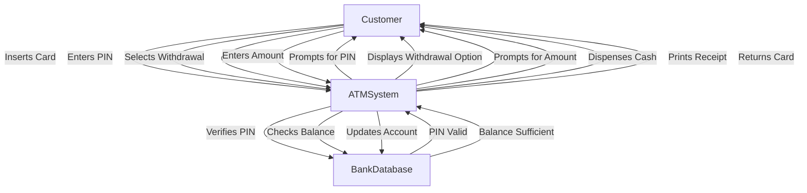

## Q-S1) Explain Composition and Aggregation with an Example in a Class Diagram?

### Answer:

### **Composition:**
**Composition** is a form of association that represents a strong "whole-part" relationship between objects. In composition, the lifetime of the part (child) depends on the whole (parent). If the parent object is destroyed, the child objects are also destroyed automatically. This relationship is denoted by a **filled diamond** on the parent side.

### Example of Composition:
Consider a **House** and **Rooms**. A **House** is composed of multiple **Rooms**. If the **House** is destroyed, the **Rooms** are also destroyed.

```plaintext
House
+ address: String
+ addRoom(): void

Room
+ roomNumber: int
+ getRoomNumber(): int
```

### UML Representation of Composition:
```plaintext
[House] ◼───[Room]
```

- **House** has a strong composition relationship with **Room**.
example of ppt


---

### **Aggregation:**
**Aggregation** is a weaker form of association that represents a "whole-part" relationship where the part can exist independently of the whole. The lifetime of the part does **not** depend on the whole. This relationship is denoted by an **empty diamond** on the parent side.

### Example of Aggregation:
Consider a **Library** and **Books**. A **Library** has a collection of **Books**, but the **Books** can exist independently of the **Library**.

```plaintext
Library
+ libraryName: String
+ addBook(): void

Book
+ title: String
+ getTitle(): String
```

### UML Representation of Aggregation:
```plaintext
[Library] ◇───[Book]
```

- **Library** has a weak aggregation relationship with **Book**.


---


### **Comparison Table** of Composition vs. Aggregation:

| **Aspect**               | **Composition**                         | **Aggregation**                          |
|--------------------------|-----------------------------------------|------------------------------------------|
| **Type of Relationship**  | Strong "whole-part"                     | Weak "whole-part"                        |
| **Dependency**            | Child objects depend on parent          | Child objects can exist independently    |
| **Notation**              | Filled diamond (◼)                     | Empty diamond (◇)                        |
| **Example**               | House and Rooms                        | Library and Books                        |

### **Key Points:**
- **Composition:** Strong relationship; child cannot exist without parent.
- **Aggregation:** Weak relationship; child can exist independently of the parent.

**Mnemonics to Remember:**
- **C**omposition = **C**omplete dependency (parent and child die together).
- **A**ggregation = **A**ssociative (parent and child live separately).

---

## Q-S2) Explain Generalization and Specialization in Class Diagram with Example

### Answer:

### **Generalization:**
**Generalization** is a relationship between a more **general** class (parent) and a more **specific** class (child). It represents an **"is-a"** relationship where the child class inherits properties and behavior (attributes and methods) from the parent class. The parent class contains the common features, while the child class adds or overrides specific features.

- **Key Concept:** A subclass (child) is a specialized version of the superclass (parent).

### Example of Generalization:
Consider a class **Vehicle** as the general class, and **Car** and **Bike** as the specialized subclasses.

```plaintext
Vehicle
+ brand: String
+ speed: int
+ accelerate(): void

Car
+ numOfDoors: int
+ openTrunk(): void

Bike
+ hasCarrier: bool
+ ringBell(): void
```

In this case:
- **Car** is a **Vehicle**.
- **Bike** is a **Vehicle**.

### UML Representation of Generalization:
```plaintext
            [Vehicle]
             /   \
      [Car]      [Bike]
```

- Both **Car** and **Bike** inherit common attributes like **brand** and **speed** from **Vehicle**.

---

### **Specialization:**
**Specialization** is the process of creating new subclasses from a general class to define specific attributes and behaviors. The subclass specializes the general class by adding new features or behaviors.

- **Key Concept:** The process of creating more specific subclasses from a general superclass.

### Example of Specialization:
In the same example of **Vehicle**, **Car** and **Bike** specialize the general class by adding their own specific attributes and methods:
- **Car** adds the attribute **numOfDoors** and method **openTrunk()**.
- **Bike** adds the attribute **hasCarrier** and method **ringBell()**.

### UML Representation of Specialization:
```plaintext
            [Vehicle]
             /   \
      [Car]      [Bike]
```

- **Car** specializes **Vehicle** by adding car-specific features.
- **Bike** specializes **Vehicle** by adding bike-specific features.

---

### **Comparison Table** of Generalization vs. Specialization:

| **Aspect**               | **Generalization**                       | **Specialization**                      |
|--------------------------|------------------------------------------|-----------------------------------------|
| **Direction**             | From specific (subclass) to general      | From general (superclass) to specific   |
| **Purpose**               | To represent common features             | To create specific versions of a class  |
| **Example**               | Vehicle is a generalization of Car and Bike | Car and Bike are specializations of Vehicle |

### **Key Points:**
- **Generalization**: Parent to child inheritance of common features (is-a relationship).
- **Specialization**: Creating subclasses with added specific features from a general parent class.

**Mnemonics to Remember:**
- **G**eneralization = "**G**rouping common" features.
- **S**pecialization = "**S**pecific details" in child classes.


---

## Q-S3) Explain Multiplicity and Cardinality with an Example in Class Diagram

### Answer:

### **Multiplicity**:
**Multiplicity** refers to the number of instances of one class that can be associated with an instance of another class in a class diagram. It defines how many objects of a class are involved in the relationship between two classes.

### **Notation for Multiplicity**:
- `1`: Exactly one instance.
- `0..1`: Zero or one instance (optional relationship).
- `*`: Zero or more instances (many).
- `n`: Exactly `n` instances.
- `n..m`: From `n` to `m` instances.

### **Example of Multiplicity**:
In a relationship between **Library** and **Books**:
- A **Library** can have multiple **Books** (denoted by `*`).
- A **Book** belongs to exactly one **Library** (denoted by `1`).

```plaintext
[Library] 1 ─── * [Book]
```

### Explanation:
- **Library** can have many books.
- Each **Book** belongs to exactly one **Library**.


---

### **Cardinality**:
**Cardinality** defines the range or exact number of instances in a relationship. It is closely related to multiplicity but usually describes the **minimum** and **maximum** number of instances allowed in a relationship.

### **Notation for Cardinality**:
- The notation for cardinality is typically the same as multiplicity, with lower and upper bounds such as `0..1`, `1`, `0..*`, etc.
- It emphasizes the count or range of instances involved.

### **Example of Cardinality**:
In a relationship between **Teacher** and **Student**:
- A **Teacher** can teach multiple **Students** (denoted by `0..*`).
- Each **Student** can have multiple **Teachers** (denoted by `1..*`).

```plaintext
[Teacher] 0..* ─── 1..* [Student]
```

### Explanation:
- **Teacher** can teach zero or more students.
- **Student** can be taught by one or more teachers.

---

### **Comparison Table** of Multiplicity vs. Cardinality:

| **Aspect**               | **Multiplicity**                         | **Cardinality**                         |
|--------------------------|------------------------------------------|-----------------------------------------|
| **Definition**            | Number of instances related between classes | Range of instances involved in a relationship |
| **Usage**                 | Defines "how many" objects are involved  | Defines the **exact** or **range** of instances |
| **Example Notation**      | `1`, `0..*`, `*`                        | `0..1`, `1..*`, `n..m`                  |

### **Key Points**:
- **Multiplicity** refers to "how many" instances can participate in a relationship.
- **Cardinality** defines the **range** or **specific number** of instances in a relationship.
  
**Mnemonics to Remember**:
- **M**ultiplicity = **M**any instances possible (focus on "how many").
- **C**ardinality = **C**ount (focus on the exact or range of instances).

---

## Q-S4) Draw and Explain the Bank Management System Class Diagram

### Answer:

### **Class Diagram for Bank Management System**:

A **Bank Management System** involves multiple entities like **Bank**, **Account**, **Customer**, and **Transaction**. Below is a class diagram representing these relationships.

### UML Representation:
```plaintext
[Bank] ◼───1..* [Account]
+ name: String
+ location: String
+ openAccount(): void
+ closeAccount(): void

[Account] ◇───1 [Customer]
+ accountNumber: int
+ balance: double
+ deposit(amount: double): void
+ withdraw(amount: double): void

[Customer]
+ name: String
+ customerID: int
+ address: String
+ createAccount(): void

[Transaction]
+ transactionID: int
+ transactionType: String
+ amount: double
+ date: Date
+ executeTransaction(): void
```

### **Explanation of the Classes**:

1. **Bank**:
   - **Attributes**:
     - `name`: The name of the bank.
     - `location`: The location of the bank.
   - **Methods**:
     - `openAccount()`: Opens a new account.
     - `closeAccount()`: Closes an existing account.
   - **Association**: The **Bank** class has a **composition** relationship with **Account**, meaning that if the bank is closed, all its accounts are destroyed as well.

2. **Account**:
   - **Attributes**:
     - `accountNumber`: A unique identifier for the account.
     - `balance`: The balance of the account.
   - **Methods**:
     - `deposit(amount)`: Deposits a specified amount into the account.
     - `withdraw(amount)`: Withdraws a specified amount from the account.
   - **Association**: The **Account** class has an **aggregation** relationship with **Customer**, meaning an account is related to a customer, but a customer can exist without an account.

3. **Customer**:
   - **Attributes**:
     - `name`: Name of the customer.
     - `customerID`: Unique identifier for the customer.
     - `address`: Address of the customer.
   - **Methods**:
     - `createAccount()`: Method for creating a new account.
   - **Association**: A customer is associated with one or more accounts. A customer can have multiple accounts, but each account belongs to one customer.

4. **Transaction**:
   - **Attributes**:
     - `transactionID`: Unique identifier for the transaction.
     - `transactionType`: Type of the transaction (e.g., deposit, withdrawal).
     - `amount`: The amount involved in the transaction.
     - `date`: The date of the transaction.
   - **Methods**:
     - `executeTransaction()`: Method to execute the transaction.
   - **Association**: Each transaction is linked to an account and a customer but is modeled separately for clarity.

### **Key Points**:
- **Bank** contains multiple **Accounts**.
- Each **Account** is owned by one **Customer**.
- **Transactions** are linked to accounts and involve deposits or withdrawals.

### **Class Relationships**:
- **Composition** between **Bank** and **Account**: If the bank is destroyed, so are the accounts.
- **Aggregation** between **Account** and **Customer**: A customer can exist without an account, but accounts belong to customers.

---

IN DARSHAN PPT


The bank management system class diagram illustrates the structure and relationships between different classes in a banking software system. It provides a visual representation of the system's object-oriented design.


### Class Breakdown:

1. **Bank**:
   - Attributes: name, code
   - Method: manageBranch()
   - Relationships: Has multiple ATMs and Branches

2. **ATM**:
   - Attributes: location, manageBy
   - Method: transaction()
   - Managed by a Branch

3. **Branch**:
   - Attributes: branchName, branchCode
   - Methods: manageAccount(), transaction()
   - Manages ATMs, Accounts, and Customers

4. **Account**:
   - Attributes: accountNumber, balance
   - Methods: debitAmount(), creditAmount(), getBalance()
   - Belongs to a Branch and owned by a Customer

5. **Customer**:
   - Attributes: name, address, dob, panNumber
   - Methods: manageAccount(), transaction()
   - Managed by a Branch, can have multiple Accounts

6. **CurrentAccount** and **SavingAccount**:
   - Subclasses of Account
   - SavingAccount has additional interestRate attribute and isTransactionLimitOut() method

### Mnemonic to Remember Class Relationships:

"**BABAC**" - Bank manages Branch, Branch manages ATM, Branch has Accounts, Accounts belong to Customers

This mnemonic helps recall the main relationships between classes in the bank management system.

---

## Q-S5) Explain Use Case Diagram with Notation Symbols and Example

### Answer:

### **Use Case Diagram:**
A **Use Case Diagram** illustrates the system's functionalities and the interactions between **actors** (users or external systems) and **use cases** (functionalities of the system). It helps visualize how the system behaves from the user's perspective.

---

### **Notation Symbols in Use Case Diagram:**


---

### **Example of Use Case Diagram: Bank ATM System**

Here’s a simple **Use Case Diagram** for an **ATM system**, showing how users interact with the system to perform basic banking tasks.

### Use Case Diagram:
```plaintext
+--------------------------------------+
|         ATM System                   |
| +----------------------------+      |
| |     Withdraw Cash           |      |
| +----------------------------+      |
| +----------------------------+      |        +------------+
| |      Deposit Cash           |      |<------>|  Customer  |
| +----------------------------+      |        +------------+
| +----------------------------+      |
| |     Check Balance           |      |
| +----------------------------+      |
+--------------------------------------+
```

### **Explanation**:
1. **Actors**:
   - **Customer**: A user who interacts with the ATM system to perform operations like withdrawing or depositing cash.
   
2. **Use Cases**:
   - **Withdraw Cash**: The customer can withdraw money from their account.
   - **Deposit Cash**: The customer can deposit money into their account.
   - **Check Balance**: The customer can check their account balance.

3. **System Boundary**: The **ATM System** is encapsulated within a **system boundary** box that defines the system's scope. All use cases fall within this boundary, representing the functionalities provided by the ATM system.

### **Include and Extend Relationships**:
- **Include**: If a use case like **Authenticate User** is necessary before accessing any functionality, it would be **included** in all other use cases.
- **Extend**: An optional functionality like **Print Receipt** could be represented as an **extend** relation with the **Withdraw Cash** use case, since it’s not always necessary.

---

### **Key Points**:
- **Actor**: Represents external users or systems interacting with the system.
- **Use Case**: Describes specific functionalities provided by the system.
- **System Boundary**: Defines the scope of the system.
- **Include**: Indicates mandatory behavior that a use case must perform.
- **Extend**: Represents optional or conditional behavior.

**Mnemonics to Remember**:
- **A**ctor: **A** person/system interacting with the system.
- **U**se Case: **U**sers' specific actions.

---

## Q-S6) Draw and explain Use case diagram of library management system.

#### **Use Case Diagram Explanation**

A **use case diagram** in a library management system depicts how various users (actors) interact with the system to achieve different goals or tasks. The key actors in the system might include **Librarian**, **Student**, **Staff**, and **Administrator**, while the main functions would include managing books, issuing and returning books, and managing members.

I will now describe a **use case diagram** for a **Library Management System**, based on typical system interactions:

---

### **Use Case Diagram for Library Management System**

```plaintext
                   +--------------------------------+
                   |      Library Management System |
                   +--------------------------------+
                               ^
                               |
     +--------------------------------------------+
     |                                            |
 +---+---+                                  +-----+------+
 |Student|                                  |  Librarian |
 +-------+                                  +------------+
      |                                          |
      |                                          |
  +------------+                        +----------------+
  | Borrow Book|                        | Issue Book     |
  +------------+                        +----------------+
      |                                          |
  +------------+                        +----------------+
  | Return Book|                        | Manage Books   |
  +------------+                        +----------------+
      |                                          |
  +------------+                        +----------------+
  | Pay Fine   |                        | Manage Members |
  +------------+                        +----------------+
                                              
```

---

#### **Actors in the Use Case Diagram**:
- **Student**: 
  - **Borrow Book**: Students can borrow books from the library.
  - **Return Book**: Students return the borrowed books to the library.
  - **Pay Fine**: If a student has a fine for late returns, they can pay it.

- **Librarian**:
  - **Issue Book**: The librarian manages the issuing of books to students.
  - **Manage Books**: The librarian is responsible for adding, removing, and updating the books in the library.
  - **Manage Members**: The librarian manages user data, including registration and removal of students and other members.

---

### **Use Cases Explained**:

1. **Borrow Book**:
   - **Actors involved**: Student, Librarian.
   - **Description**: A student requests a book, and the librarian checks its availability. If available, the librarian issues the book to the student, recording the transaction.

2. **Return Book**:
   - **Actors involved**: Student, Librarian.
   - **Description**: A student returns a borrowed book. The librarian accepts the book and updates the system to reflect the return.

3. **Pay Fine**:
   - **Actors involved**: Student.
   - **Description**: If a book is returned late, the student is required to pay a fine before borrowing new books.

4. **Issue Book**:
   - **Actors involved**: Librarian, Student.
   - **Description**: The librarian issues books to students, maintaining a record of all issued and returned books.

5. **Manage Books**:
   - **Actors involved**: Librarian.
   - **Description**: The librarian handles adding new books, removing outdated books, and updating the book database.

6. **Manage Members**:
   - **Actors involved**: Librarian, Administrator.
   - **Description**: The librarian or administrator manages the student and staff records, adding new users or removing old ones.

---

### Summary:
The **use case diagram** visually depicts how different users (actors) like **Students** and **Librarians** interact with a library management system. It provides a high-level overview of the system's core functionalities, including borrowing books, managing books, and paying fines.

### Conclusion:
The use case diagram clarifies how different actors interact with the system, helping in understanding system functionality and user requirements.

### Key Points:
- **Actors**: Student, Librarian, Administrator.
- **Use Cases**: Borrow Book, Return Book, Pay Fine, Issue Book, Manage Books, Manage Members.

IN DARSAHN PPT


---

## Q-S7) What are the elements of a behavioral model? Prepare use case diagram and sequence diagrams for ATM system of a bank.

#### **Elements of a Behavioral Model**

A **behavioral model** in software engineering captures the dynamic aspects of a system, focusing on how the system behaves in different scenarios. The core elements of a behavioral model are:

1. **Use Cases**: These define the functional requirements by describing how users (actors) interact with the system to achieve specific goals.
2. **Sequence Diagrams**: These illustrate how objects in a system interact with each other over time by showing the sequence of messages exchanged between them.
3. **State Diagrams**: These represent the states an object can be in and how it transitions from one state to another in response to events.
4. **Activity Diagrams**: These show the flow of activities or processes in the system, capturing the workflow among various components.

---

### **Use Case Diagram for ATM System**

The **ATM system** of a bank provides functionalities like cash withdrawal, balance inquiry, depositing cash, and changing the PIN. Here's a use case diagram that depicts the interactions of the users (customers) with the ATM system:

```plaintext
+--------------------------------------------+
|                ATM System                  |
+--------------------------------------------+
                ^         ^         ^
                |         |         |
       +--------+     +---+---+    +------+
       | Cash   |     |Balance |    | PIN  |
       |Withdrawal|   | Inquiry|    |Change|
       +--------+     +-------+    +------+
           ^              ^            ^
           |              |            |
        +------+      +--------+   +---------+
        |Customer|    |Customer|   |Customer |
        +------+      +--------+   +---------+
```

#### **Actors**:
- **Customer**: The user of the ATM system who can perform tasks such as withdrawing cash, checking account balance, and changing the PIN.

#### **Use Cases**:
- **Cash Withdrawal**: The customer inserts their ATM card, enters the PIN, and selects the cash withdrawal option to withdraw money from their account.
- **Balance Inquiry**: The customer checks their current account balance using this option.
- **PIN Change**: The customer can change their ATM PIN using this functionality.

---

### **Sequence Diagram for ATM Cash Withdrawal**

In a **sequence diagram**, we show how objects (actors) interact with each other over time to complete a task. Below is the sequence diagram for the **cash withdrawal** process from an ATM system:

```plaintext
Customer       ATM Machine         Bank Server
   |                |                   |
   |  Insert Card   |                   |
   |--------------->|                   |
   |                |                   |
   |  Enter PIN     |                   |
   |--------------->|                   |
   |                |    Validate PIN   |
   |                |------------------>|
   |                |                   |
   |                |  PIN Valid/Invalid|
   |                |<------------------|
   |                |                   |
   |  Select Amount |                   |
   |--------------->|                   |
   |                | Request Withdrawal|
   |                |------------------>|
   |                |   Confirm Balance |
   |                |<------------------|
   |                |                   |
   |    Dispense Cash                    |
   |<---------------|                   |
   |                |                   |
```

---

### Explanation of Sequence Diagram:

1. **Insert Card**: The customer inserts their ATM card into the ATM machine.
2. **Enter PIN**: The customer enters their PIN, and the ATM machine sends this information to the bank server for validation.
3. **Validate PIN**: The bank server verifies if the PIN is correct and sends a validation response back to the ATM machine.
4. **Select Amount**: The customer selects the amount of cash they wish to withdraw.
5. **Request Withdrawal**: The ATM sends a withdrawal request to the bank server.
6. **Confirm Balance**: The bank server checks the account balance and approves or declines the transaction.
7. **Dispense Cash**: The ATM dispenses the cash to the customer if the transaction is approved.

---

### Summary:

- **Behavioral models** represent the dynamic behavior of systems through interactions between users and system components.
- For an **ATM system**, key interactions include cash withdrawal, balance inquiry, and PIN change.
- The **use case diagram** shows the main functionalities of the system, and the **sequence diagram** represents the flow of events during cash withdrawal.

### Conclusion:
Behavioral models like **use case** and **sequence diagrams** provide valuable insights into the flow of interactions in a system. They help developers understand the roles of different components and ensure smooth user experience.

### Key Points:
- Elements of a behavioral model include **use cases**, **sequence diagrams**, **state diagrams**, and **activity diagrams**.
- **ATM system** key interactions: Cash withdrawal, balance inquiry, PIN change.
- Sequence diagrams represent the **step-by-step** flow of messages between actors and system objects.

Let me know if you need further explanation or details!

## Q-S8) Explain Components of Sequence Diagram with Example

#### **Introduction to Sequence Diagrams**
A **sequence diagram** is a type of **interaction diagram** in UML (Unified Modeling Language) that shows how objects interact with each other in a particular sequence of events. It emphasizes the **order** of message exchanges between objects (or actors) over time to achieve a specific outcome.

---

### **Components of a Sequence Diagram**

A sequence diagram consists of several key components:

| **Component**       | **Description**                                                                 |
|---------------------|---------------------------------------------------------------------------------|
| **Actor**           | A user or external system that interacts with the system. Represented by a stick figure. |
| **Object**          | A class or entity in the system that performs actions or receives actions. Represented by rectangles with underlined names. |
| **Lifeline**        | A dashed vertical line that shows the object's existence over time.              |
| **Activation Bar**  | A narrow rectangle on a lifeline showing that an object is active or executing a task at that point in time. |
| **Messages**        | Horizontal arrows between objects indicating communication or method calls.      |
| **Return Message**  | A dashed arrow showing a return from a message or method call.                   |
| **Self-Message**    | An arrow that loops back to the same object, representing recursive methods or internal processing. |
| **Guard Condition** | A condition that must be true for a message to be sent.                          |
| **Destruction**     | Represents the termination of an object. It’s shown as an ‘X’ at the end of a lifeline. |

---

### **Detailed Components**:

1. **Actor**:
   - Represents a person, external system, or entity interacting with the system.
   - Example: In an ATM system, the **Customer** is an actor.

2. **Objects**:
   - Objects represent instances of classes that interact in the system. They are denoted by a rectangle with the object name underlined.
   - Example: In the ATM system, objects like **ATM Machine**, **Bank Server** are involved.

3. **Lifeline**:
   - The vertical dashed line drawn from an object or actor represents its lifespan during the interaction.
   - Example: The **Customer's lifeline** begins when the customer interacts with the ATM system.

4. **Activation Bar**:
   - Indicates the period during which an object is active (performing tasks). It appears as a narrow rectangle on the object's lifeline.
   - Example: When the ATM is processing a transaction, its activation bar will be visible.

5. **Messages**:
   - Messages indicate interactions between objects. A solid arrow shows the call, while a dashed arrow indicates the return.
   - Example: The **Customer** sends a **withdrawal request** to the **ATM Machine**.

6. **Return Message**:
   - This is a dashed arrow that indicates the return of control from a message or method call.
   - Example: After a withdrawal request, the **ATM Machine** sends a **confirmation message** back to the **Customer**.

7. **Self-Message**:
   - A message that an object sends to itself. It’s represented by an arrow that loops back to the same object.
   - Example: The **ATM Machine** may internally check balance before processing the transaction.

8. **Guard Condition**:
   - A Boolean expression that must be true for a message to be sent. It is written in square brackets.
   - Example: The **withdrawal transaction** will only be processed if `[balance >= withdrawal amount]`.

9. **Destruction**:
   - The termination of an object during the interaction. It’s represented by an ‘X’ at the end of the lifeline.
   - Example: After the transaction is completed, the **ATM Machine** may terminate the session.

---

### **Example Sequence Diagram: ATM Withdrawal**

Here's an example sequence diagram for the **ATM cash withdrawal** process:

```plaintext
Customer      ATM Machine      Bank Server
   |               |                |
   | Insert Card   |                |
   |-------------> |                |
   |               | Validate Card  |
   |               |--------------> |
   |               | Card Valid     |
   |               | <--------------|
   | Enter PIN     |                |
   |-------------> |                |
   |               | Validate PIN   |
   |               |--------------> |
   |               | PIN Valid      |
   |               | <--------------|
   | Select Amount |                |
   |-------------> |                |
   |               | Request Amount |
   |               |--------------> |
   |               | Confirm Balance|
   |               | <--------------|
   | Dispense Cash |                |
   |<------------- |                |
```

---

### **Explanation of the Sequence Diagram Example:**

1. **Customer** inserts the ATM card into the **ATM Machine**.
2. **ATM Machine** sends a message to the **Bank Server** to validate the card.
3. **Bank Server** sends a confirmation message indicating the card is valid.
4. **Customer** enters the PIN, and **ATM Machine** forwards it to the **Bank Server** for validation.
5. Upon validation of the PIN, the **Customer** selects the withdrawal amount.
6. **ATM Machine** sends a withdrawal request to the **Bank Server**.
7. The **Bank Server** confirms the account balance and approves the withdrawal.
8. **ATM Machine** dispenses the cash to the **Customer**.

---


### Key Points:
- **Actor**: Represents a user or external entity interacting with the system.
- **Object**: Represents system components interacting in the sequence.
- **Lifeline**: Shows the existence of objects over time.
- **Messages**: Depict the communication between objects.

---

## Q-S9) Explain Components of State Diagram with Example

#### **Introduction to State Diagrams**
A **state diagram** (or **state machine diagram**) in UML is used to represent the dynamic behavior of a system. It depicts the various **states** an object or system can be in and how it transitions from one state to another in response to **events**.

---

### **Components of a State Diagram**

A state diagram consists of several key components:

| **Component**          | **Description**                                                                 |
|------------------------|---------------------------------------------------------------------------------|
| **State**              | Represents a specific condition or situation of an object during its lifetime.   |
| **Initial State**      | The state in which an object starts its lifecycle. Represented by a solid black circle. |
| **Final State**        | The state that indicates the end of the object's lifecycle. Represented by a black circle surrounded by a border. |
| **Transition**         | The movement from one state to another in response to an event.                  |
| **Event**              | An action or occurrence that triggers a transition.                              |
| **Action**             | A task or activity performed during a transition or within a state.              |
| **Guard Condition**    | A Boolean expression that must be true for a transition to occur.                |
| **Composite State**    | A state that contains nested states, indicating complex behavior.                |

---

### **Detailed Components:**

1. **State**:
   - Represents the **status** or **condition** of an object at a specific moment.
   - It is depicted as a **rounded rectangle** with the state's name written inside.
   - Example: In an **ATM system**, states could include **Idle**, **Card Inserted**, **Processing Transaction**, etc.

2. **Initial State**:
   - The starting point of the state diagram.
   - Represented by a **solid black circle**.
   - Example: The ATM begins in the **Idle** state when there is no activity.

3. **Final State**:
   - Represents the termination of the process or lifecycle of an object.
   - Depicted as a **black circle with a surrounding border**.
   - Example: In the ATM system, after a transaction is completed, the ATM reaches a **Session End** state.

4. **Transition**:
   - Shows how an object **moves** from one state to another in response to an **event**.
   - Depicted by a **solid arrow** between two states.
   - Example: When a customer **inserts a card**, the ATM moves from **Idle** to **Card Inserted** state.

5. **Event**:
   - An **action** or **input** that triggers a transition between states.
   - Example: Events in the ATM system could include **Card Inserted**, **PIN Entered**, **Withdraw Requested**, etc.

6. **Action**:
   - A task performed during a state transition or while the object is in a specific state.
   - Example: When in the **Card Inserted** state, the ATM might perform an action like **Validate Card**.

7. **Guard Condition**:
   - A **Boolean expression** that must evaluate to `true` for the transition to happen.
   - Example: The ATM system will only proceed to the **Processing Transaction** state if the condition **PIN is valid** is true.

8. **Composite State**:
   - A state that contains other **nested states** inside it.
   - Represents complex behavior where the system can enter a sub-state while in a broader state.
   - Example: In the **Processing Transaction** state, there could be **Validating PIN** and **Validating Balance** sub-states.

---

### **Example State Diagram: ATM System**

Here's an example of a state diagram for an **ATM system**:

```plaintext
+-----------------------+
|                       |
|       Idle            | <-------- Initial State
|                       |
+-----------------------+
          |
          V
+-----------------------+
|                       |
|   Card Inserted       | -------------> [Invalid Card] -> Final State
|                       |
+-----------------------+
          |
          V
+-----------------------+
|                       |
|    PIN Entered        | -------------> [Invalid PIN] -> Final State
|                       |
+-----------------------+
          |
          V
+-----------------------+
|                       |
| Processing Transaction|  --> [Low Balance] --> Final State
|                       |
+-----------------------+
          |
          V
+-----------------------+
|                       |
|   Transaction Done    |
|                       |  --> Final State
+-----------------------+
```

---

### **Explanation of the Example:**

1. **Idle**: The ATM begins in the **Idle** state, waiting for user input.
2. **Card Inserted**: Once a card is inserted, the ATM moves to the **Card Inserted** state.
3. **PIN Entered**: After the card is inserted, the user enters their PIN, and the ATM moves to the **PIN Entered** state.
4. **Processing Transaction**: If the PIN is valid, the ATM moves to the **Processing Transaction** state, where it checks the account balance and processes the request.
5. **Transaction Done**: If the transaction is successful, the system moves to the **Transaction Done** state.
6. **Final State**: The process ends, and the ATM returns to the **Final State** after the transaction.

---


### **Key Points**:
- **State**: Represents the current condition of an object.
- **Transition**: Represents the movement from one state to another.
- **Event**: An occurrence that triggers a transition.
- **Guard Condition**: A condition that must be satisfied for the transition.
- **Initial/Final State**: Represent the beginning and end of the process.

---

## Q-S10) What are Non-Functional Requirements?

### **Definition:**
**Non-functional requirements (NFRs)** refer to the criteria that specify the operation of a system rather than its specific behaviors or functionalities. They describe how a system performs certain actions and define its **quality attributes** like performance, usability, reliability, and security.

---

### **Key Characteristics of Non-Functional Requirements**:
1. **Quality Attributes**: Focus on how well the system performs rather than what the system does.
2. **Global Constraints**: Often affect the entire system rather than specific components or functionalities.
3. **Measurable**: They should be quantifiable so they can be tested or validated.
4. **User Experience**: NFRs often deal with aspects like user experience, operational limits, and security protocols.

---

### **Examples of Non-Functional Requirements**:

| **NFR Category**      | **Example**                                                                 |
|-----------------------|------------------------------------------------------------------------------|
| **Performance**        | The system should respond to user queries within 2 seconds.                  |
| **Usability**          | The user interface should be easy to navigate for both novice and expert users. |
| **Reliability**        | The system should have 99.9% uptime availability throughout the year.         |
| **Scalability**        | The system should support up to 10,000 concurrent users without performance degradation. |
| **Security**           | All transactions must be encrypted using SSL.                                |
| **Maintainability**    | The system should allow easy addition of new features with minimal impact on existing code. |
| **Portability**        | The software should run on both Windows and Linux environments.               |

---

### **Key Points to Remember**:
- Non-functional requirements define the **quality attributes** of a system.
- They can include aspects such as **performance**, **security**, **usability**, and **reliability**.
- Unlike functional requirements, NFRs focus on **how well** the system performs rather than **what it does**.

### **Mnemonic to Remember**: 
**FURPS** – a common acronym used to remember key categories of NFRs:
- **F**: Functionality (usability, security)
- **U**: Usability (user-friendliness)
- **R**: Reliability (uptime, error tolerance)
- **P**: Performance (speed, scalability)
- **S**: Supportability (maintainability, portability)

---

## Q-S11) What are Functional Requirements?

### **Definition:**
**Functional requirements** describe the specific behaviors, tasks, or functionalities that a system must perform. These requirements define **what the system is supposed to do** by detailing the inputs, behavior, and outputs of the system. They capture the essential functionality that satisfies the user's needs or business goals.

---

### **Key Characteristics of Functional Requirements**:
1. **Behavioral Focus**: Describes what actions or tasks the system should perform.
2. **User-Centric**: Often derived from user stories, scenarios, or business goals.
3. **Specific**: Clearly defined actions or processes, often broken down into smaller units like use cases.
4. **Testable**: Functional requirements should be verifiable and measurable through testing.

---

### **Examples of Functional Requirements**:

| **Functional Area** | **Example** |
|---------------------|-------------|
| **Login System**    | The system should allow users to log in using a valid username and password. |
| **Search Feature**  | The system should provide a search feature that allows users to find books by title, author, or ISBN. |
| **Transaction**     | The system should allow users to transfer money between accounts. |
| **Reporting**       | The system should generate a monthly report of sales for the admin. |
| **Notifications**   | The system should send email notifications when a user’s subscription is about to expire. |

---

### **Functional Requirements in Software Development**

1. **Use Case Specification**: The functional requirements describe individual use cases and define how the system interacts with users or other systems.
2. **User Interface Requirements**: Functional requirements often specify how users should interact with the system, like button clicks or form submissions.
3. **Business Rules**: Specific business rules or calculations that need to be implemented fall under functional requirements (e.g., "If the user is a premium member, apply a 10% discount").

---

### **Key Points to Remember**:
- Functional requirements define **what the system does**.
- They describe specific **tasks, operations, or interactions** that the system must support.
- Functional requirements are typically derived from **user needs** or **business processes**.

---

### **Mnemonic to Remember**:
**BRIFT** – to help remember key categories of functional requirements:
- **B**: Business Logic (how business rules work)
- **R**: Reports (what information is provided)
- **I**: Interfaces (interaction points like login, payment)
- **F**: Features (specific features like search, notifications)
- **T**: Transactions (specific tasks like money transfer)

---

### **Difference Between Functional and Non-Functional Requirements**

| **Aspect**              | **Functional Requirements**                              | **Non-Functional Requirements**                           |
|-------------------------|----------------------------------------------------------|------------------------------------------------------------|
| **Focus**               | Specifies **what** the system should do.                 | Specifies **how** the system should operate.                |
| **Type**                | Business logic, tasks, user interactions.                | Quality attributes like performance, security, usability.   |
| **Measured by**         | Use cases, functionality tests.                          | Performance metrics, usability tests, security standards.   |
| **Example**             | "The system should allow users to make online payments." | "The system should process payments within 2 seconds."      |

---

## Q-S12) What is Requirement Engineering? List the Functional and Non-Functional Requirements.

### **Requirement Engineering Definition:**
**Requirement Engineering (RE)** is the process of gathering, analyzing, validating, and managing the requirements of a system or software project. It ensures that the stakeholders’ needs are correctly captured and documented, leading to the successful development of the system.

The process of requirement engineering aims to create a complete, consistent, and clear description of the software product's **functional and non-functional requirements**.

---

### **Phases of Requirement Engineering**:
1. **Requirement Elicitation**: Collecting requirements from stakeholders.
2. **Requirement Analysis**: Evaluating the gathered requirements for clarity, completeness, and feasibility.
3. **Requirement Specification**: Documenting the requirements in a clear and organized manner (like in Software Requirement Specification (SRS) documents).
4. **Requirement Validation**: Ensuring that the requirements meet the needs of the stakeholders.
5. **Requirement Management**: Handling changes and updates to the requirements throughout the software development lifecycle.

---

### **Functional Requirements**:

**Functional requirements** define the specific behavior or functions of the system. They describe **what the system must do**.

#### **Examples of Functional Requirements**:
- **Login/Authentication**: The system should allow users to log in using a username and password.
- **Search**: The system should allow users to search for products by category, name, or price.
- **Data Entry**: The system should allow the user to input new customer data.
- **Report Generation**: The system should generate monthly sales reports.
- **Transaction Processing**: The system should process payments made by users.

---

### **Non-Functional Requirements**:

**Non-functional requirements (NFRs)** describe **how the system performs** certain tasks rather than the specific functions it performs. These are often referred to as the **quality attributes** of the system.

#### **Examples of Non-Functional Requirements**:
- **Performance**: The system should handle up to 10,000 concurrent users.
- **Security**: User passwords should be encrypted and stored securely.
- **Reliability**: The system should have 99.9% uptime during normal operation.
- **Scalability**: The system should be able to scale horizontally to handle increased load.
- **Usability**: The system interface should be intuitive and easy to use for non-technical users.

---

### **Comparison Between Functional and Non-Functional Requirements**

| **Aspect**                  | **Functional Requirements**                       | **Non-Functional Requirements**                          |
|-----------------------------|---------------------------------------------------|----------------------------------------------------------|
| **Definition**              | What the system should do                         | How the system should operate                            |
| **Focus**                   | System behavior and operations                    | System quality and user experience                       |
| **Measurement**             | Functional tests (use cases, user stories)        | Performance, security, usability testing                 |
| **Example**                 | "Allow users to create accounts"                  | "The account creation process should take less than 2 seconds" |

---

### **Key Points to Remember**:
- **Requirement Engineering** is a critical phase in software development where functional and non-functional requirements are gathered, analyzed, and validated.
- **Functional requirements** define **what** the system must do.
- **Non-functional requirements** define **how well** the system must perform.

---

### **Mnemonic to Remember**:  
**EAVS-M** – To remember the steps of Requirement Engineering:
- **E**: Elicitation (gathering requirements)
- **A**: Analysis (review and refine)
- **V**: Validation (ensure correctness)
- **S**: Specification (documenting requirements)
- **M**: Management (tracking changes)

---

## Q-S13) Develop a Complete Use Case for “Making a Withdrawal at an ATM”

### **Use Case Title**:  
**Making a Withdrawal at an ATM**

---

### **Primary Actor**:  
**Bank Customer**

---

### **Stakeholders and Interests**:
1. **Bank Customer**: Wants to withdraw money from their account quickly and securely.
2. **Bank**: Ensures the transaction is processed securely, deducting the correct amount, and updating the balance.
3. **ATM System**: Facilitates the transaction while verifying customer credentials and account balance.

---

### **Preconditions**:
- The ATM machine must be **connected to the bank network**.
- The bank customer must have an **active debit card** and a **valid PIN**.
- The customer must have a **sufficient account balance** for the requested withdrawal amount.

---

### **Postconditions**:
- The requested **amount is deducted** from the customer's account.
- The ATM **dispenses the requested cash**.
- The transaction **receipt is printed** for the customer.

---

### **Main Success Scenario (Basic Flow)**:

| **Step No.** | **Action/Description** |
|--------------|-------------------------|
| 1            | The **customer inserts their debit card** into the ATM machine. |
| 2            | The system **prompts the customer to enter their PIN**. |
| 3            | The customer **enters the PIN**, and the system verifies it. |
| 4            | The system displays a menu of **transaction options** (e.g., Withdraw, Deposit, Check Balance). |
| 5            | The customer selects the **“Withdraw”** option. |
| 6            | The system prompts the customer to **enter the amount** to withdraw. |
| 7            | The customer enters the amount, and the system **checks if the balance is sufficient**. |
| 8            | If sufficient, the system **dispenses the cash** and updates the account balance. |
| 9            | The system **prints a receipt** showing the transaction details. |
| 10           | The system **ejects the card**, and the customer takes the card and the cash. |
| 11           | The system returns to the idle state, ready for the next transaction. |

---

### **Alternate Flows**:

- **Invalid PIN Entry**:
  1. If the customer enters an invalid PIN, the system prompts them to retry.  
  2. After 3 failed attempts, the system **retains the card** and ends the session.

- **Insufficient Funds**:
  1. If the customer requests more money than the available balance, the system displays a message stating **“Insufficient Funds”**.
  2. The system returns to the main menu, allowing the customer to choose a smaller amount or end the session.

- **ATM Out of Cash**:
  1. If the ATM runs out of cash, it will display an **“ATM Out of Service”** message and end the session.

---

### **Exceptions**:
- **Network Error**: If the ATM loses connection with the bank, the system will display a message, **“Unable to process transaction, please try later”**, and return the card.

---

### **Use Case Diagram for ATM Withdrawal**:



---

### **Summary**:
- The use case for **“Making a Withdrawal at an ATM”** describes a series of steps taken by the customer and ATM system to successfully withdraw money. It includes the basic flow, alternate flows for invalid actions, and exceptions like network errors.

---

## Q-S14) List and Explain Different Categories of Software Risks

### Answer:

**Software risks** are potential problems or vulnerabilities that could cause the software development process to fail, leading to project delays, budget overruns, or failure to meet requirements. Understanding and managing these risks is crucial for successful project completion.

### **Categories of Software Risks**:

1. **Project Risks**:
   - **Definition**: Risks that affect the **project schedule, resources, or overall management**.
   - **Examples**:
     - **Inadequate project planning**: Poor estimation of time and effort.
     - **Unrealistic deadlines**: Project timelines that are too tight to meet.
     - **Resource shortages**: Lack of skilled personnel or budget overruns.
     - **Scope creep**: Continuous addition of new features, causing delays and confusion.

   | **Impact**: Project risks often lead to schedule delays and budget increases.

2. **Technical Risks**:
   - **Definition**: Risks that affect the **quality of the software** or the ability to meet technical specifications.
   - **Examples**:
     - **Technology limitations**: Using immature or unproven technology that fails to meet requirements.
     - **Integration issues**: Challenges in integrating third-party tools or systems.
     - **Complex requirements**: Difficulty in implementing features due to technical complexity.
     - **Performance bottlenecks**: Poor system performance under load or real-time constraints.

   | **Impact**: Technical risks can degrade software performance, quality, and reliability.

3. **Business Risks**:
   - **Definition**: Risks that affect the **business objectives** or the value the software provides to the organization.
   - **Examples**:
     - **Market risks**: Software may not meet the needs of the market or may be released too late.
     - **Financial risks**: The project might exceed the budget or fail to generate the expected return on investment.
     - **Changing business environment**: Shifts in the company’s strategy or market conditions can make the software irrelevant.
     - **Legal risks**: Non-compliance with laws or regulations affecting the business.

   | **Impact**: Business risks can result in financial losses or missed business opportunities.

4. **Security Risks**:
   - **Definition**: Risks that affect the **security and confidentiality** of the software or its data.
   - **Examples**:
     - **Data breaches**: Unauthorized access to sensitive user or business data.
     - **Vulnerabilities in the system**: Exploitable weaknesses in the software.
     - **Denial of Service (DoS) attacks**: Attacks that render the system unusable.
     - **Compliance failures**: Inability to meet regulatory requirements (e.g., GDPR, HIPAA).

   | **Impact**: Security risks can lead to data loss, legal action, and loss of user trust.

5. **Operational Risks**:
   - **Definition**: Risks related to **operating and maintaining** the software system.
   - **Examples**:
     - **Failure in deployment**: Issues in rolling out software updates or new versions.
     - **Downtime**: Extended periods of system unavailability.
     - **Lack of technical support**: Inability to maintain the software due to missing documentation or skilled personnel.
     - **Poor change management**: Problems in handling changes or updates to the software.

   | **Impact**: Operational risks can cause system failures and disrupt normal business operations.

6. **Process Risks**:
   - **Definition**: Risks that arise from **poor development practices** or **inadequate processes**.
   - **Examples**:
     - **Inadequate testing**: Insufficient testing can lead to software defects and failures.
     - **Lack of documentation**: Missing or outdated documentation causes confusion and inefficiencies.
     - **Poor communication**: Misunderstanding between team members or with stakeholders.
     - **Inflexible processes**: Rigid development methodologies that don't adapt to project changes.

   | **Impact**: Process risks lead to poor-quality software and project inefficiencies.

---

### **Comparison Table of Software Risk Categories**:

| **Category**       | **Definition**                                       | **Examples**                                                         |
|--------------------|------------------------------------------------------|----------------------------------------------------------------------|
| **Project Risks**   | Risks affecting project schedule or resources        | Inadequate planning, unrealistic deadlines, scope creep               |
| **Technical Risks** | Risks related to software quality and technology     | Technology limitations, integration issues, performance bottlenecks   |
| **Business Risks**  | Risks affecting business objectives                  | Market changes, financial losses, legal compliance                    |
| **Security Risks**  | Risks affecting software security and confidentiality| Data breaches, vulnerabilities, compliance failures                   |
| **Operational Risks**| Risks related to software operation and maintenance | Downtime, deployment failures, poor change management                 |
| **Process Risks**   | Risks from poor development practices or processes   | Inadequate testing, lack of documentation, poor communication         |

---

### **Key Points**:
- **Project risks** affect timelines and resources.
- **Technical risks** impact software quality and functionality.
- **Business risks** threaten the value and success of the project.
- **Security risks** compromise data and system integrity.
- **Operational risks** hinder smooth software operations.
- **Process risks** result from poor development practices.

**Mnemonics to Remember**:
- **P-T-B-S-O-P**: **P**roject, **T**echnical, **B**usiness, **S**ecurity, **O**perational, **P**rocess.

---
